Schools need accurate enrollment forecasting for stability and success.
Forecasting informs decisions they face annually: staffing, resource allocation,
and budget planning. When projections are accurate, schools can hire the exact
number of teachers needed to maintain good student-teacher ratios, ensuring that
no classroom is overcrowded and no teacher is overburdened. Enrollment also
dictates the number of desks and devices to purchase, the logistics of bus
routes, and more. Accurate predictions prevent budget shortfalls or wasted
surplus. Every dollar can be directed toward enhancing a student's education.

Traditional approaches often rely on manual spreadsheets, static formulas,
simple cohort survival ratios, and rigid rolling averages. These methods are
reactive and prone to human error. They don't account for complex, non-linear
variables, such as shifting local demographics and enrollment volatility.
Administrators are left with basic arithmetic and "gut feeling." We want to
avoid last-minute hiring and empty classrooms that drain resources.

I want to treat enrollment forecasting as a data science problem. Join me as I
document how I built a machine learning enrollment prediction system using
Python. It is a pipeline designed to ingest historical data and intelligently
predicts enrollment for the next future year. This system uses ML libraries like
Scikit-Learn to train and evaluate multiple models, and automatically handles
the heavy lifting of data cleaning, feature engineering, and hyperparameter
tuning. I built a reliable system that analyzes trends and gives me data-backed
confidence in the numbers it generates.

To find the right tool for the job, I set up a competition between three
approaches: a standard Linear Regression baseline, a Gradient Boosting
Regressor, and a Random Forest Regressor.

## Data: The Foundation of Predictions

Data fuels this engine. For the pipeline to function, I needed a well-defined
input format. I chose a clean, flat CSV file with four essential columns:
`school`, `grade`, `school_year`, and `enrollment`. This granularity is
non-negotiable. It allows the model to distinguish between, say, a growing
kindergarten class at a specific elementary school and a shrinking senior class
at a high school. Since this input format is well-defined, I could more easily
build feature engineering scripts to generate the lag, rolling average, and
other features necessary for training.

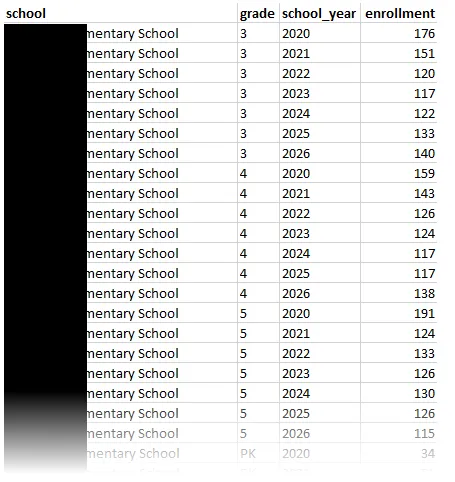

To generate a CSV file in this format, I wrote a SQL query tailored for the
specific information system that contained my source data. Consistency is key in
time-series forecasting, so I implemented a "Count Date" methodology, capturing
enrollment numbers specifically on a particular day of the year for each
academic year. This ensures we aren't comparing, say, a September roster from
2018 with a January roster from 2023. The query also normalized internal grade
level codes.

I wrote the query and executed it on the information system to output the data
needed to generate predictions.

This query is just an example, but demonstrates the concept:

```sql
SELECT
    s.name AS school,
    -- Grade normalization
    CASE
        WHEN e.grade_level_code IN ('P1', 'P2', 'PK_AM', 'PK_PM') THEN 'PK'
        WHEN e.grade_level_code IN ('KG', 'K_FULL', '00') THEN 'K'
        ELSE e.grade_level_code -- Keeps 1-12 as is, assuming they are standard
    END AS grade,
    e.school_year,
    COUNT(DISTINCT e.student_id) AS enrollment
FROM enrollment e
JOIN schools s ON e.school_id = s.id
WHERE
    -- Count date methodology
    CAST(CONCAT(e.school_year, '-10-01') AS DATE) 
        BETWEEN e.entry_date AND COALESCE(e.exit_date, '9999-12-31')
GROUP BY
    s.name,
    2, -- Refers to the calculated 'grade' column (the CASE statement)
    e.school_year
```

## Initial Exploration

Before writing any training code, I wrote some exploration code to output some
charts and graphs to help me visualize the historical data to understand the
baseline volatility I was dealing with.

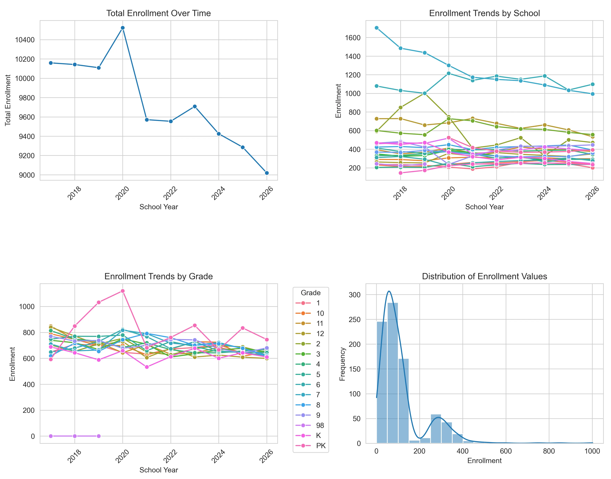

The numbers are definitely not static. There is a significant peak around 2020,
reaching nearly 10,500 students, followed by a drop the very next year. This
volatility is most likely due to the COVID-19 pandemic. Since that reset, the
data shows a brief recovery followed by a steady downward trajectory through
2026. This proves that a simple "average growth" formula would not suffice. The
data is a complex, non-linear narrative that requires a model capable of
adapting to sudden shifts.

Digging deeper into the dataset via box plots exposes more variance hidden
within the aggregate numbers.

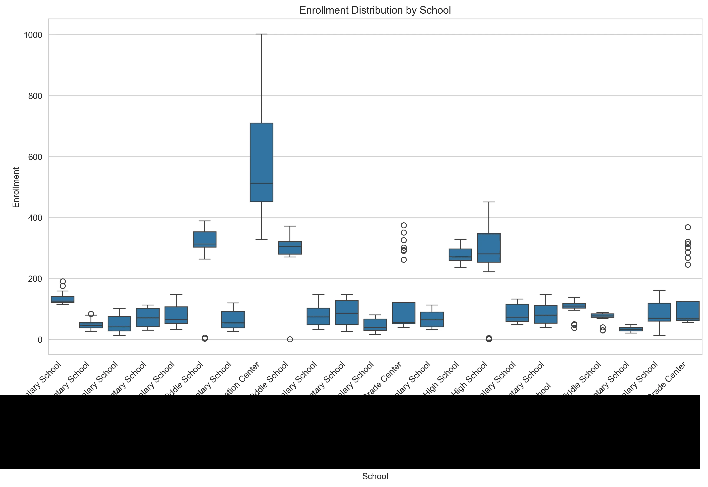

The school-level distribution reveals big size differences. Some schools operate
with vastly larger enrollment than others. In this dataset, the word "average"
is not very meaningful.

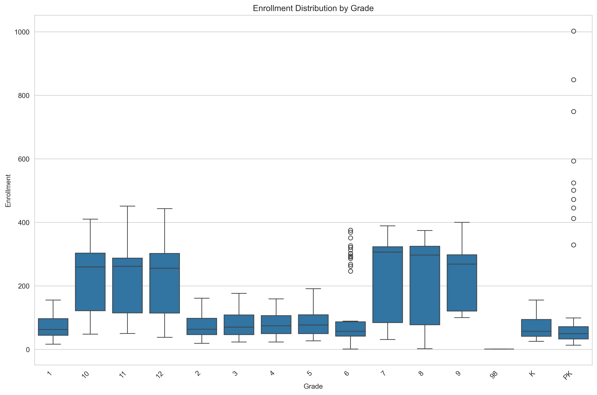

Similarly, the grade-level breakdown highlights more patterns. High school
cohorts (grades 9-12) display significantly higher counts and wider volatility
compared to the relatively stable elementary years. This means that "School" and
"Grade" have to be treated as categorical features. A model trained on general
trends without these specific contexts would fail to capture the uniqueness of
each building.

## The Prediction Pipeline

With exploration done, I built the main pipeline script. It acts as the
orchestrator of the project. It imports the data cleaning, feature generation,
model training, and evaluation scripts into one easy-to-use command line tool.
Using Python's `argparse` library, it allows me to interact with the system from
the terminal, accepting arguments for the specific prediction year or a
preferred training window. Under the hood, the script executes a sequential
workflow: it first ingests the raw data to build the features, then initiates
the training tournament to identify the best performing algorithm (usually the
Random Forest), and finally applies that champion model to generate and save the
future enrollment forecasts to a CSV file. The goal is to make this multi-step
data science experiment more deployable.

Again, this code is just a demonstration of the concept:

```python
import argparse
import sys

import feature_engineering as fe  # Handles data cleaning and feature generation
import model_training as mt       # Handles the algorithm tournament
import forecasting as fc          # Handles applying the model to future dates

def main():
    # Setup arguments
    parser = argparse.ArgumentParser()
    
    parser.add_argument(
        '--target_year', 
        type=int, 
        required=True
    )
    
    parser.add_argument(
        '--window', 
        type=int, 
        default=5
    )

    args = parser.parse_args()

    try:
        # Ingestion and feature engineering
        training_data = fe.create_dataset(lookback_window=args.window)

        # Model training competition
        champion_model = mt.find_best_model(training_data)

        # Forecasting
        forecast_df = fc.predict_future(champion_model, year=args.target_year)

        # Output
        output_filename = f"forecast_{args.target_year}.csv"
        forecast_df.to_csv(output_filename, index=False)

    except Exception as e:
        print(f"\nError: The pipeline failed.\n{e}")
        sys.exit(1)

if __name__ == "__main__":
    main()
```

The main pipeline script imports the more focused, individual scripts, such as
the feature engineering script. Feature engineering provides the context the
model needs to learn. In the feature engineering script, I transform the flat
CSV into a richer training set. The script starts with enforcing logical sort
orders for grades (ensuring 'Kindergarten' comes before '1st Grade') and
filtering out anomalies. From there, it constructs temporal features, generating
lag variables and rolling averages that allow the model to see recent history at
a glance. Most importantly, I implemented a custom function to create cohort
features. These features simulate the natural flow of a school system. By
mapping the "previous grade" from the "previous year" to the current row, I
calculate a cohort progression ratio. This critical feature teaches the model
that the size of this year's 3rd-grade class is the strongest predictor for next
year's 4th-grade class, effectively capturing the "survival rate" of cohorts as
they move through the district.

Here's the basic concept:

```python
import pandas as pd
import numpy as np

def create_dataset(lookback_window=5):
    df = pd.read_csv('raw_enrollment_data.csv')

    # Enforce grade sort order
    grade_map = {'PK': -1, 'K': 0, '1': 1, '2': 2, '3': 3, '4': 4, 
                 '5': 5, '6': 6, '7': 7, '8': 8, '9': 9, '10': 10, '11': 11, '12': 12}
    
    df['grade_id'] = df['grade'].map(grade_map)
    df = df.sort_values(by=['school', 'grade_id', 'school_year'])

    # Temporal features
    grouper = df.groupby(['school', 'grade'])

    df['enrollment_lag_1'] = grouper['enrollment'].shift(1)
    df['enrollment_lag_2'] = grouper['enrollment'].shift(2)
    df['enrollment_lag_3'] = grouper['enrollment'].shift(3)
    
    # Rolling averages smooth out noisy years
    df['enrollment_rolling_avg_2yr'] = grouper['enrollment'].transform(lambda x: x.rolling(2).mean())
    df['enrollment_rolling_avg_3yr'] = grouper['enrollment'].transform(lambda x: x.rolling(3).mean())
    
    # Simple numeric time index for regression models (e.g., 2018 -> 0, 2019 -> 1)
    df['time_index'] = df['school_year'] - df['school_year'].min()

    # Cohort features    
    df['target_prev_grade_id'] = df['grade_id'] - 1
    df['target_prev_year'] = df['school_year'] - 1

    lookup_df = df[['school', 'grade_id', 'school_year', 'enrollment']].copy()
    lookup_df.rename(columns={'enrollment': 'prev_year_prev_grade_enrollment'}, inplace=True)

    df = pd.merge(
        df, 
        lookup_df, 
        left_on=['school', 'target_prev_grade_id', 'target_prev_year'],
        right_on=['school', 'grade_id', 'school_year'],
        how='left',
        suffixes=('', '_lookup')
    )

    # Progression ratio
    df['cohort_progression_ratio'] = df['enrollment'] / df['prev_year_prev_grade_enrollment']
    df['cohort_progression_ratio'] = df['cohort_progression_ratio'].fillna(1.0)

    # Cleanup and export
    final_cols = [
        'school', 'grade', 'school_year', 
        'enrollment_lag_1', 'enrollment_lag_2', 'enrollment_lag_3',
        'enrollment_rolling_avg_2yr', 'enrollment_rolling_avg_3yr',
        'time_index', 'prev_year_prev_grade_enrollment', 'cohort_progression_ratio'
    ]
    
    # Remove rows with NaN created by lags (the first few years of data)
    clean_df = df.dropna(subset=['enrollment_lag_3'])[final_cols]
    
    return clean_df

if __name__ == "__main__":
    create_dataset()
```

And a sample of the output:

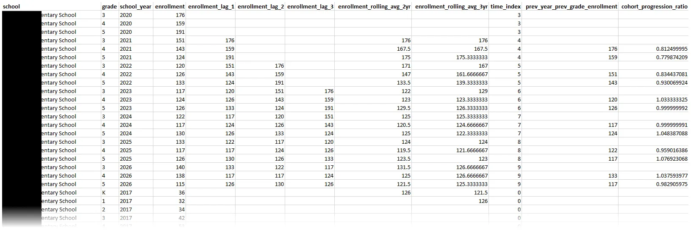

With the features ready, I needed a way to determine how accurate the models
were. I implemented a training strategy split across a couple files. First, I
used one file to establish a sanity check using a simple Linear Regression
baseline. If my advanced models couldn't beat this, I was over-engineering.
Linear regression basically draws a trend line through the historic data points
and then extends that line out into the future to see where enrollment will be
in the future.

```python
import pandas as pd
from sklearn.linear_model import LinearRegression
from sklearn.metrics import mean_absolute_error

def run_baseline(df):
    # Time-based split
    test_year = df['school_year'].max()
    
    train_df = df[df['school_year'] < test_year]
    test_df  = df[df['school_year'] == test_year]

    # Define features
    features = [
        'enrollment_lag_1', 
        'enrollment_lag_2', 
        'enrollment_rolling_avg_2yr', 
        'time_index', 
        'cohort_progression_ratio'
    ]
    target = 'enrollment'

    X_train = train_df[features]
    y_train = train_df[target]
    
    X_test  = test_df[features]
    y_test  = test_df[target]

    # Train
    model = LinearRegression()
    model.fit(X_train, y_train)

    # Evaluation
    predictions = model.predict(X_test)
    mae = mean_absolute_error(y_test, predictions)

    return model, mae
```

Then I built more advanced models in a separate file: Random Forest and Gradient
Boosting Regressors. These models are generally excellent at handling non-linear
relationships. To test accuracy, I simulated a real-world scenario by training
on all historical data except the most recent year, then asked the models to
"predict" that known final year (e.g., train on 2016-2024, test on 2025). This
"out-of-time" validation provides the feedback loop needed to pick a winning
model.

```python
import pandas as pd
from sklearn.ensemble import RandomForestRegressor, GradientBoostingRegressor
from sklearn.metrics import mean_absolute_error

def find_best_model(df):
    # Time-based split
    test_year = df['school_year'].max()
    train_df = df[df['school_year'] < test_year]
    test_df  = df[df['school_year'] == test_year]

    # Define features
    features = [
        'enrollment_lag_1', 'enrollment_lag_2', 
        'enrollment_rolling_avg_2yr', 'time_index', 
        'cohort_progression_ratio'
    ]
    target = 'enrollment'

    X_train = train_df[features]
    y_train = train_df[target]
    X_test  = test_df[features]
    y_test  = test_df[target]

    # Contestants
    models = {
        "Random Forest": RandomForestRegressor(n_estimators=100, random_state=42),
        "Gradient Boosting": GradientBoostingRegressor(n_estimators=100, random_state=42)
    }

    # Competition
    best_mae = float('inf') # Start with infinite error
    champion = None

    for name, model in models.items():
        # Train
        model.fit(X_train, y_train)
        
        # Predict
        predictions = model.predict(X_test)
        
        # Evaluate
        mae = mean_absolute_error(y_test, predictions)

        # Determine winner
        if mae < best_mae:
            best_mae = mae
            champion = model
    
    # Retrain the champion on ALL data (Train + Test) before forecasting the future.
    champion.fit(df[features], df[target])
    
    return champion
```

While the default settings in Scikit-Learn are a solid starting point, I wanted
to squeeze every ounce of accuracy out of the system. I wrote a script to
automate the process of tuning the model's hyperparameters. I started by
targeting the Random Forest's architecture. Instead of testing every possible
combination of parameters (which takes forever), I implemented
RandomizedSearchCV. This technique samples a wide range of possibilities for
parameters like the number of trees (n\_estimators), maximum depth (max\_depth),
etc. The script identifies the specific configuration that produces the best
predictions.

```python
import pandas as pd
import numpy as np
from sklearn.ensemble import RandomForestRegressor
from sklearn.model_selection import RandomizedSearchCV

def optimize_random_forest(df):
    # Prepare data
    features = [
        'enrollment_lag_1', 'enrollment_lag_2', 
        'enrollment_rolling_avg_2yr', 'time_index', 
        'cohort_progression_ratio'
    ]
    target = 'enrollment'

    X = df[features]
    y = df[target]

    # Define the parameter grid
    param_grid = {
        # How many trees to build (More is usually better but slower)
        'n_estimators': [100, 200, 300, 500],
        # How complex can each tree get (Too deep = overfitting)
        'max_depth': [None, 10, 20, 30],
        #  Minimum students required to create a new logic branch
        'min_samples_split': [2, 5, 10]
    }

    # Initialize base model
    rf = RandomForestRegressor(random_state=42)

    # Randomized search
    search = RandomizedSearchCV(
        estimator=rf,
        param_distributions=param_grid,
        n_iter=10,
        cv=3,            # Cross-Validation: Splits data 3 ways to verify results
        verbose=1,
        n_jobs=-1,       # Use all computer processors
        random_state=42
    )

    search.fit(X, y)

    # Results
    best_params = search.best_params_
    best_score = search.best_score_ # R-squared value
    
    # Return the optimized model ready for use
    return search.best_estimator_
```

To be able to import these files into the main pipeline, we'll need a
model\_training file that glues everything together:

```python
import baseline_model
import advanced_models
import tuning

def find_best_model(df):
    baseline_model.run_baseline(df)
    champion = advanced_models.find_best_model(df)
    if champion.name == "Random Forest":
        champion = tuning.optimize_random_forest(df)
    
    features = [
        'enrollment_lag_1', 'enrollment_lag_2', 
        'enrollment_rolling_avg_2yr', 'time_index', 
        'cohort_progression_ratio'
    ]
    
    champion.fit(df[features], df['enrollment'])
    
    return champion
```

## Choosing the Best Model

When we crunch the numbers, the distinction between the models is a landslide.

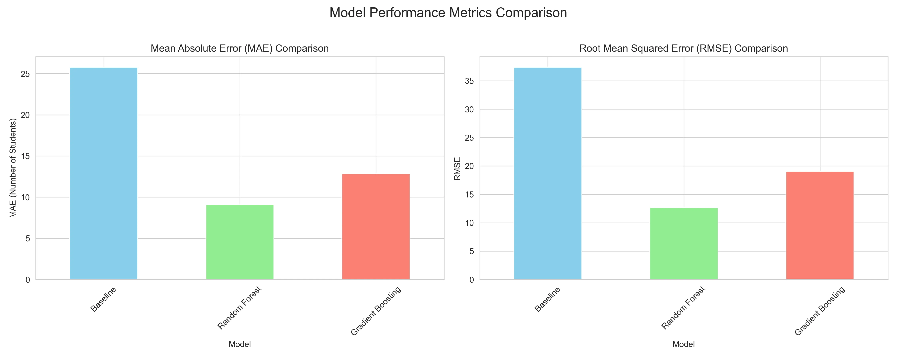

The baseline Linear Regression yields a Mean Absolute Error (MAE) of 25.78,
missing the mark by an entire classroom of students on average. The Gradient
Boosting model offers a respectable improvement (MAE 12.84). But the Random
Forest Regressor proves to be the best, driving the error down to only **9.1**
students per prediction. A Root Mean Squared Error (RMSE) of **12.67** further
confirms its stability. The RMSE result indicates that it isn't just accurate on
average, but also less prone to wild outliers.

Let's see where the models were succeeding or failing.

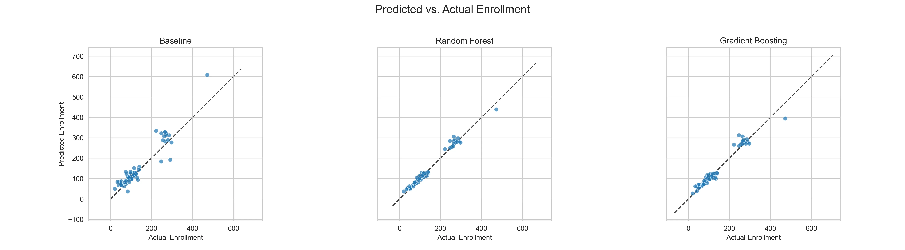

While the baseline's predictions scatter loosely, guessing with a wide margin of
error, the Random Forest's predictions hug the diagonal "perfect fit" line.

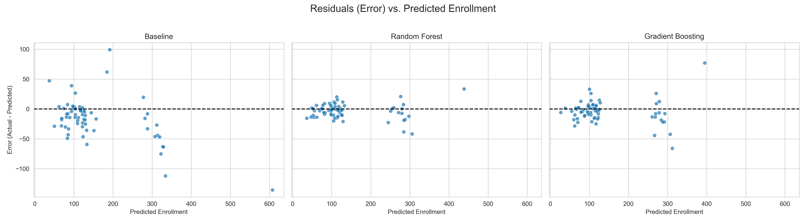

Even more telling is the residual analysis, which plots the error for every
single prediction. In a healthy model, these errors should look like random
noise centered around zero. The Baseline fails, showing a bias where errors grow
significantly larger as enrollment numbers increase. The Random Forest's
residuals, however, remain tightly clustered around the zero line across the
board. It's pretty good across all school sizes and grade levels.

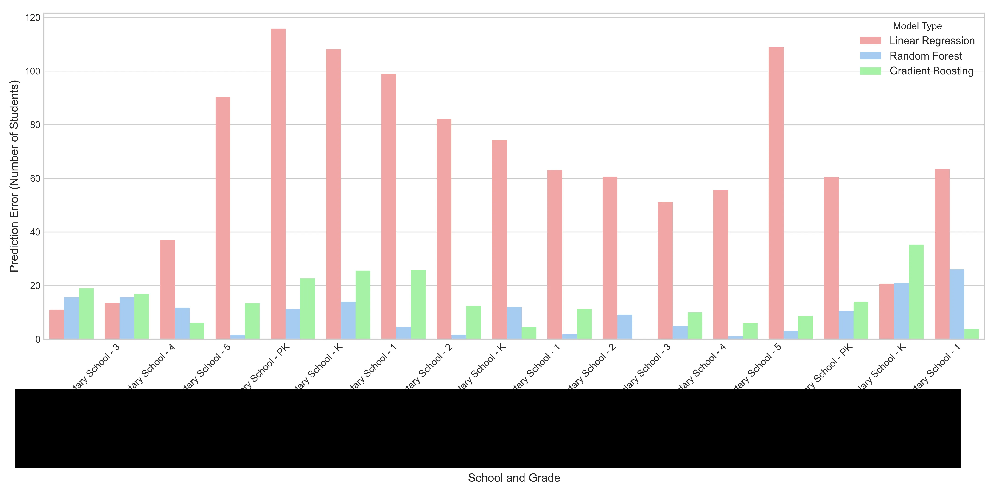

We can also look at this from a "crystal ball" analysis perspective. This
visualization useful to non-technical users who need to understand the
performance of the models. For each school and grade combination, the chart
shows how many students the model was off. You can see that the baseline linear
regression model is almost always off by the most amount of students and the
random forest model is off by the least.

The Random Forest Regressor demonstrated the most robust understanding of the
underlying data dynamics. Enrollment forecasting is a complex interaction of
cohort survival rates, varying school capacities, and demographic shifts. Linear
Regression isn't flexible enough and Gradient Boosting struggles with
consistency for this type of data. But the Random Forest excels here. By
averaging the predictions of hundreds of decision trees, it cancels out
individual errors and overfitting. This makes the Random Forest forecast precise
enough for staffing and stable enough for budgeting.

## The Training Window Experiment

I also questioned how usable the pre-2020 data was, given how drastically the
pandemic altered everything. To test this recency bias hypothesis, I wrote a
script that retrained the Random Forest on restricted windows (3, 5, and 7
years) to see if a shorter memory improved accuracy.

```python
import pandas as pd
from sklearn.ensemble import RandomForestRegressor
from sklearn.metrics import mean_absolute_error

def test_window_sensitivity(df):
    # We test on the most recent known year
    test_year = df['school_year'].max()

    # Compare these specific history lengths
    windows = [3, 5, 7] 

    features = [
        'enrollment_lag_1', 'enrollment_lag_2', 
        'enrollment_rolling_avg_2yr', 'time_index', 
        'cohort_progression_ratio'
    ]
    target = 'enrollment'

    for lookback in windows:
        # Filter
        start_year = test_year - lookback
        subset_df = df[df['school_year'] >= start_year].copy()
        
        # Split
        train_df = subset_df[subset_df['school_year'] < test_year]
        test_df  = subset_df[subset_df['school_year'] == test_year]

        # Train and evaluate
        model = RandomForestRegressor(n_estimators=100, random_state=42)
        model.fit(train_df[features], train_df[target])
        
        predictions = model.predict(test_df[features])
        error = mean_absolute_error(test_df[target], predictions)
        
        print(f"{lookback}-year window MAE: {error:.2f}")
```

The model actually performed worse when restricted to recent history, with the
3-year window spiking the error rate (RMSE 16.00) compared to the baseline full
history (RMSE 12.67). It turns out that even "outdated" pre-pandemic data
provides valuable variance that helps the Random Forest distinguish between
genuine trends and temporary blips. For this specific dataset, maximizing the
historical context yields the best results.

## Outputs and Interpretations

The ultimate deliverable of this project isn't the model itself, but the
predictions it generates. I designed the output CSV to be immediately consumable
by non-technical users, mirroring the format of the input data but swapping
historical data for future forecasts.

```python
import pandas as pd
import numpy as np

def predict_future(model, year):
    # Identify most recent data
    df = pd.read_csv('raw_enrollment_data.csv')
    latest_known_year = df['school_year'].max()
    
    # Filter for the current active students
    current_roster = df[df['school_year'] == latest_known_year].copy()

    # Construct future dataframe
    future_df = current_roster[['school', 'grade']].copy()
    future_df['school_year'] = year
    
    # Generate features
    
    future_df['enrollment_lag_1'] = current_roster['enrollment'].values
    
    # For this simplified demo, we assume stability for older lags/ratios.
    # In a real production system, you would calculate these recursively.
    future_df['enrollment_lag_2'] = current_roster['enrollment'].values 
    future_df['enrollment_rolling_avg_2yr'] = current_roster['enrollment'].values
    future_df['cohort_progression_ratio'] = 1.0  # Assumes 100% survival rate for the demo
    
    # Update the time index (e.g., if last year was index 5, this is index 6)
    future_df['time_index'] = 100 # Arbitrary high number for the future

    # Predict
    features = [
        'enrollment_lag_1', 'enrollment_lag_2', 
        'enrollment_rolling_avg_2yr', 'time_index', 
        'cohort_progression_ratio'
    ]
    
    predictions = model.predict(future_df[features])

    # Format output
    future_df['enrollment_prediction'] = np.round(predictions).astype(int)
    final_output = future_df[['school', 'grade', 'school_year', 'enrollment_prediction']]
    
    return final_output
```

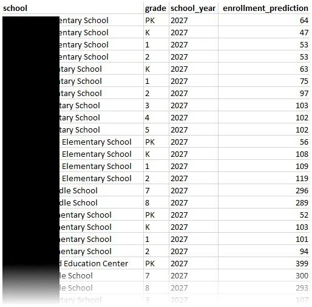

It provides a granular, row-by-row breakdown that tells us, for example, that a
particular elementary school should prepare for exactly 103 third-graders in
2027 while another elementary school needs to staff for a Pre-K cohort of 64.
This standardized format ensures that the data can be opened in Excel for manual
review or imported into dashboard tools for more visualization.

In addition to the predictions, I was also able to output many files detailing
my evaluation along the way. Transparency is just as important as accuracy, so I
ensured the pipeline leaves a detailed paper trail. This includes the visuals
you see on this post, and also granular CSV reports on each model's performance
and comparisons between them.

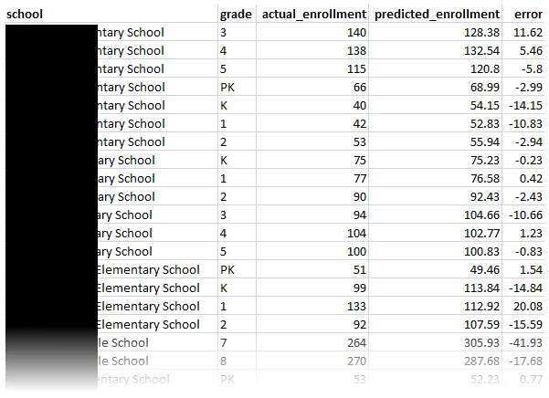

This comprehensive documentation helps demystify some of the "black box"
problems that come with machine learning. It can provide proof to justify the
numbers.

## Conclusion

Building this system has transformed a guessing game into a science. By
engineering features and benchmarking different algorithms, I created a machine
learning model that achieves an MAE of 9.1 and an RMSE of 12.67. I can now
provide the foundation for a proactive strategy, where decisions on allocating
resources are backed by statistical evidence rather than historical inertia.

Machine learning models require continuous refinement. The next phase of
development will focus on more data ingestion. How about external indicators
like housing permits and birth rates? These could capture other shifts even
before a student sets foot in a classroom. On the engineering side, I aim to
build a direct connection to the information system, allowing for real-time
model retraining and automated drift detection. I also plan to integrate this
system with existing dashboards to further empower non-technical users.

Cover photo by [Pawel Czerwinski](https://unsplash.com/@pawel_czerwinski) on
[Unsplash](https://unsplash.com/photos/a-close-up-of-a-purple-and-black-background-TNIy2MF3JBQ).