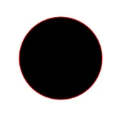
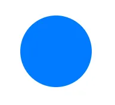

Did you know you can create hyperlinks on SVG shapes? The `<a>` tag is valid
inside `<svg>`.

Most links (`<a>`) elements on the web are rectangles.

```html
<a href="#">I'm a link.</a>
```


And for most cases, this is perfectly fine. But what if you want a circular
link?

### A primitive solution

One common method is to create and link an image.

```html
<a href="#">
  
</a>
```


But there are quite a few disadvantages to this technique:

1. The linked area is actually still rectangular.
2. The text is not selectable.
3. An `alt` attribute is required for accessibility and indexing purposes.
4. You can't (without creating another image) change the visual style of this
   link on focus, hover, visited, etc.

The reason the linked area above is still rectangular is because images on the
web — even if they don't _appear_ to be — are always rectangular.

In fact, this is how most elements are. `div`, `p`, `table`, `h1`, and pretty
much any element you may be familiar with: as far as the browser is concerned,
they are all rectangular by default.

```html
<div>I'm a div.</div>

<p>I'm a paragraph</p>

<table>
  <tbody>
    <tr>
      <td>I'm</td>
      <td>a</td>
      <td>table.</td>
    </tr>
  </tbody>
</table>

<h1>I'm a heading.</h1>
```


### A better solution

You can, however, define elements of other shapes! The solution comes to us from
scalable vector graphics (SVG).

Here's a circle:

```html
<svg width="120" height="120">
  <circle cx="60" cy="60" r="60" />
</svg>
```



You can even change the color.

```html
<svg width="120" height="120">
  <circle cx="60" cy="60" r="60" fill="#007BFF" />
</svg>
```



And you can place text over it.

```html
<svg width="120" height="120">
  <circle cx="60" cy="60" r="60" fill="#007BFF" />

  <text
    x="60"
    y="60"
    fill="#FFFFFF"
    text-anchor="middle"
    alignment-baseline="middle"
  >
    I'm a circle.
  </text>
</svg>
```


And best of all, you can wrap both the `circle` and the `text` in an `<a>`
tag.

```html
<svg width="120" height="120">
  <a href="#">
    <circle cx="60" cy="60" r="60" fill="#007BFF" />

    <text
      x="60"
      y="60"
      fill="#FFFFFF"
      text-anchor="middle"
      alignment-baseline="middle"
    >
      I'm a link.
    </text>
  </a>
</svg>
```

The clickable part of the link is the actual circle (and text) element.


You can use CSS to change the style on hover.

```css
a:hover circle {
  fill: #00b2ff;
}
```

### Custom shapes

You can link other elements besides `circle`. If you want to define a custom
shape, you could use [the `<path>`
element](https://developer.mozilla.org/en-US/docs/Web/SVG/Tutorial/Paths).

```html
<svg width="120" height="120">
  <a href="#">
    <path
      d="M   0   0
             L 120   0
             L 120 120
             L  60  80
             L   0 120
             Z"
      fill="#007BFF"
    />

    <text
      x="60"
      y="50"
      fill="#FFFFFF"
      text-anchor="middle"
      alignment-baseline="middle"
    >
      Bookmark
    </text>
  </a>
</svg>
```

```css
a:hover path {
  fill: #00b2ff;
}
```


With `<path>` the possibilities really are endless. You can create the
exact shape you need by defining its points in the `d` attribute.

### I thought you said custom _BUTTONS, not links._

I tend to use the terms **link** and **button** interchangeably nowadays
because, while one might be more semantically correct in a given situation,
anything one can do, the other can do, too.

Say you want to create a custom-shaped button that submits a form.

First, build the form.

```html
<form id="myForm" method="post">
  <input name="userName" placeholder="Your name" /><br />

  <!-- submit button goes here -->
</form>
```

Add a custom-shaped button using SVG.

```html
<form id="myForm" method="post">
  <input name="userName" placeholder="Your name" /><br />

  <svg width="120" height="50">
    <a href="#" id="submitBtn">
      <path
        d="M   0  10
               L  50  10
               L  60   0
               L  70  10
               L 120  10
               L 120 120
               L  60  80
               L   0 120
               Z"
        fill="#007BFF"
      />

      <text
        x="60"
        y="30"
        fill="#FFFFFF"
        text-anchor="middle"
        alignment-baseline="middle"
      >
        Submit
      </text>
    </a>
  </svg>
</form>
```

Notice the `id` attributes on both the form and the link.

Now, wire up the button in JavaScript.

```javascript
document.getElementById("submitBtn").addEventListener("click", () => {
  document.getElementById("myForm").submit();
});
```

The code above…

1. Gets a reference to the submit button
2. Listens for a click event
3. When clicked, gets a reference to the form itself
4. Submits it

[You can see the code and try out this technique in this
CodePen.](https://codepen.io/travishorn/pen/vWoQOL)
