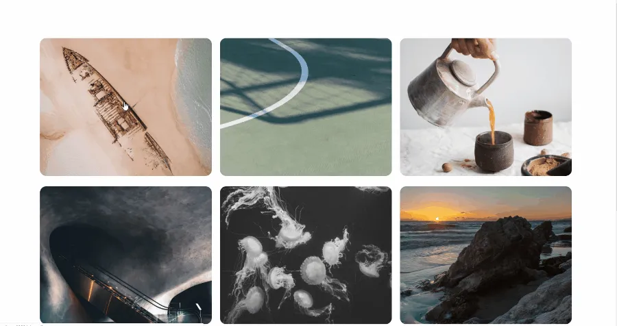
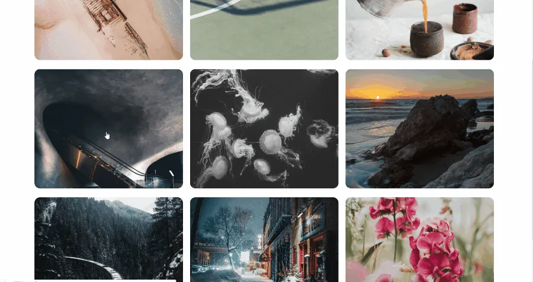

An interactive gallery of photos is the perfect use-case for Vue and the CSS
Grid Layout.

This article describes every step along the way to building this photo gallery
app.


If you prefer to look the code itself, you can find the repository on GitHub:
[travishorn/photo-gallery](https://github.com/travishorn/photo-gallery).

### Prerequisites

To follow along, you'll need [Node.js](https://nodejs.org/en) and version 3 of
the [Vue CLI](https://cli.vuejs.org/).

To install Node.js, go to [the homepage](https://nodejs.org/en) and find your
download.

Once Node.js is installed, open a terminal and install the Vue CLI.

```console
npm install -g @vue/cli
```

### Setup

In a terminal, create a new app with the Vue CLI. This will create a new
directory in the current directory.

```console
vue create photo-gallery
```

It will ask you to pick a preset. Choose `Manually select features`.

```console
Vue CLI v3.4.1
? Please pick a preset: (Use arrow keys)
  default (babel, eslint)
> Manually select features
```

Arrow down to `Router` and press `Space` to select it.

```console
? Check the features needed for your project:
 (*) Babel
 ( ) TypeScript
 ( ) Progressive Web App (PWA) Support
>(*) Router
 ( ) Vuex
 ( ) CSS Pre-processors
 (*) Linter / Formatter
 ( ) Unit Testing
 ( ) E2E Testing
```

You can leave all other options as they are and press `Enter`.

For the rest of the options, feel free to accept the defaults by pressing
`Enter` at each prompt.

When the CLI finishes, you'll have a new directory called `photo-gallery` which
contains a sample Vue app.

Serve the app.

```console
cd photo-gallery
npm run serve
```

The sample app will be available at
[http://localhost:8080/](http://localhost:8080/).


Keep the development server running as we develop the app. It will automatically
reload as we update components.

### The Data

A photo gallery contains photos and information about those photos. You can use
your own, or [download the sample photos I
used](https://raw.githubusercontent.com/travishorn/photo-gallery/master/photo-gallery-images.zip).

Create a new directory under `src/` called `images/`. Place all the photo image
files in this directory.

Inside `src/images/` create another directory called `thumbnails/`. This
directory should contains image files with the exact same name as the original
photo files. The images in this directory should be scaled down and compressed
versions of the same photos.

For best results, I sized all of these thumbnail images to exactly 600 x 600
pixels.

Finally, inside the `src/` directory, create a file called `photos.json`. This
will be our "database" of photos. It should contain all the information about
each photo.

Here is a sample of the structure of this file. If you're using my sample
photos, you can [download the JSON
file](https://raw.githubusercontent.com/travishorn/photo-gallery/master/src/photos.json).

```json
[
  {
    "id": 0,
    "title": null,
    "filename": "andreas-dress-1406323-unsplash.jpg",
    "location": "Fraser Island Beach",
    "source": {
      "name": "Unsplash",
      "url": "https://unsplash.com"
    },
    "photographer": {
      "name": "Andreas Dress",
      "url": "https://unsplash.com/@picsbydress"
    }
  },
  {
    "id": 1,
    "title": null
    // ... snip ...
  }
  // ... snip ...
]
```

At this point, we have scaffolded a Vue app and added some photo data. The file
structure looks something like this. Note that I'm only including the most
relevant files and directories here so you can get an idea of where everything
important should be.

```
node_modules/
public/
src/
  assets/
    images/
      andreas-dress-1406323-unsplash.jpg
      ... a bunch of other image files ...
    thumbnails/
      andreas-dress-1406323-unsplash.jpg
      ... a bunch of other thumbnails ...
  components/
  views/
  App.vue
  main.js
  photos.json
  router.js
.browserslistrc
.eslintrc.js
.gitignore
... a bunch of other project files ...
```

### Grid-based Gallery

Let's start by modifying `App.vue`. This is the root component everything else
will go into. We can remove basically everything in it and replace it with the
following.

```vue
<template>
  <router-view />
</template>

<style>
@import url("https://fonts.googleapis.com/css?family=Roboto");

html {
  font-size: 22px;
}
body {
  font-family: "Roboto", sans-serif;
}

a {
  color: #0094ff;
  text-decoration: none;
}

a:hover {
  color: #0074c6;
}
</style>
```

There's nothing too crazy going here. The template simply contains the router's
view and nothing else. Then there's some basic font and color styles.

By default, the router points to the `Home` view. This view is defined in
`src/views/Home.vue`. Let's edit that now.

This is another simple one. Replace everything in the file with the following.

```vue
<template>
  <Gallery />
</template>

<script>
import Gallery from "@/components/Gallery.vue";

export default {
  name: "home",
  components: {
    Gallery,
  },
};
</script>
```

This view is simply showing the `Gallery` component. This component doesn't
exist, yet. Let's create it.

Create `src/components/Gallery.vue`. Here's the first big chunk of our app.

The template looks like this:

```vue
<template>
  <div class="gallery">
    <div class="gallery-panel" v-for="photo in photos" :key="photo.id">
      
    </div>
  </div>
</template>
```

Inside the main `div`, we're using a `v-for` to loop over a `photos` property
and create `div`s for each one.

Each of these `div`s contains an image.

Each image's `src` is set by a function we'll define next.

Now for the script.

```vue
<script>
import photos from "@/photos.json";

export default {
  name: "Gallery",
  data() {
    return {
      photos,
    };
  },
  methods: {
    thumbUrl(filename) {
      return require(`../assets/images/thumbnails/${filename}`);
    },
  },
};
</script>
```

In this file, we import the "database" JSON file from earlier.

We use this JSON data to set the `photos` property in the `data` object. This
property is an array of photo data that our template loops over to create `div`s
for each photo.

In the `methods` area, we're defining the `thumbUrl()` function we use in the
template. The template passes the photo's filename to this function and it
returns the URL to the photo's thumbnail.

At this point, the images are displayed on the page.


Some styling will go a long way here.

```vue
<style>
.gallery {
  display: grid;
  grid-template-columns: repeat(auto-fill, minmax(20rem, 1fr));
  grid-gap: 1rem;
  max-width: 80rem;
  margin: 5rem auto;
  padding: 0 5rem;
}

.gallery-panel img {
  width: 100%;
  height: 22vw;
  object-fit: cover;
  border-radius: 0.75rem;
}
</style>
```

On our container `.gallery` we set `display: grid` and set the
`grid-template-columns`. With this style, columns are automatically adjusted
based on the number of photos and the size of the viewport.

Photos will be displayed in a grid and automatically resize. If the photos get
to below `20rem` (about `440px `in our case), a column gets dropped to allow the
photos to stay above `20rem`.


### Lightbox

It's looking great so far. Now we want users to be able to click on a photo and
see the full image front-and-center.

For that, we'll wrap each image with a link. Since we're using Vue Router, we'll
use `router-link` instead of an `a` tag.

Update the template.

```vue
<template>
  <div class="gallery">
    <div class="gallery-panel" v-for="photo in photos" :key="photo.id">
      <router-link :to="`/photo/${photo.id}`">
        
      </router-link>
    </div>
  </div>
</template>
```

The link has a dynamic `to` attribute which points it to `/photo/${photo.id}`.
For example, the first image — which has an `id` of `0`— will link to
`/photo/0`.

We need to set up that route. Open `src/router.js`.

Delete the sample `/about` route so the entire router looks like this.

```javascript
import Vue from "vue";
import Router from "vue-router";
import Home from "./views/Home.vue";

Vue.use(Router);

export default new Router({
  mode: "history",
  base: process.env.BASE_URL,
  routes: [
    {
      path: "/",
      name: "home",
      component: Home,
    },
  ],
});
```

At the top, import a photo component which we'll build in a moment. Then, add a
route that uses it.

```javascript
import Vue from 'vue';
import Router from 'vue-router';
import Home from './views/Home.vue';
**import Photo from './views/Photo.vue';**

Vue.use(Router);

export default new Router({
  mode: 'history',
  base: process.env.BASE_URL,
  routes: [
    {
      path: '/',
      name: 'home',
      component: Home,
    },
    {
      path: '/photo/:id',
      name: 'photo',
      component: Photo,
    },
  ],
});
```

We can now build the view for this route. Create `src/views/Photo.vue`.

```vue
<template>
  <Photo />
</template>

<script>
import Photo from "@/components/Photo.vue";

export default {
  name: "photo",
  components: {
    Photo,
  },
};
</script>
```

This is another simple file. The template is just showing one component, which
we import in the script. Normally, we would just leave this file out and wire
our route directly to the component, but we'll need to modify this view later to
add a feature, so it's important.

The `Photo` view is importing a `Photo` component. Create
`src/components/Photo.vue`. This is the last big chunk of the app.

Let's start with a simple template.

```vue
<template>
  <div class="lightbox">
    

    <div class="lightbox-info">
      <div class="lightbox-info-inner">Info</div>
    </div>
  </div>
</template>
```

The `.lightbox` `div` is like the container for the image and the info we'll
display next to it.

The `img` tag actually displays the image. It's `src` attribute uses another
function we'll code up in the script.

Immediately after the `img` there's a `div` which will contain information about
the photo. You may also notice an inner `div` which will be used for styling.

Now for the script.

```vue
<script>
import photos from "@/photos.json";

export default {
  name: "Photo",
  data() {
    return {
      photos,
    };
  },
  computed: {
    photo() {
      return this.photos.find((photo) => {
        return photo.id === Number(this.$route.params.id);
      });
    },
  },
  methods: {
    photoUrl(filename) {
      return require(`../assets/images/${filename}`);
    },
  },
};
</script>
```

Here again, we're importing `photos.json` to get the photo data.

But this time we're using a computed property which find the photo with the `id`
specified in the URL.

Finally, there's the `photoUrl()` function which returns an image URL based on a
filename. This time, instead of the thumbnail, it provides the URL to the full
resolution image.

Going back to the running app… click on an image and you'll be brought to the
photo view. So far, the component displays the image and a small bit of text
that just says "info".

The photo is way too big and the info text is pushed off the page. We need some
styling.

```vue
<style>
.lightbox {
  position: fixed;
  top: 0;
  left: 0;
  width: 100%;
  height: 100%;
  background-color: rgba(0, 0, 0, 0.8);
  display: grid;
  grid-template-columns: repeat(3, 1fr);
  grid-gap: 2rem;
}

.lightbox img {
  margin: auto;
  width: 100%;
  grid-column-start: 2;
}

.lightbox-info {
  margin: auto 2rem auto 0;
}

.lightbox-info-inner {
  background-color: #ffffff;
  display: inline-block;
  padding: 2rem;
}
</style>
```

For the container `.lightbox` we fix it so that it takes up the entire viewport.
It also has a semi-transparent dark background color. Perhaps most importantly,
it uses `display: grid` with 3 equal width columns.

The `.lightbox-img` has automatic margins, putting it in the center of it's
column. The width is 100% so it always takes up the whole column (and _only_ the
column — no overflow), and it has `grid-column-start: 2` so that it starts in
the second column of our 3-column grid. This puts it in the center.

`.lightbox-info` has a margin of `auto 2rem auto 0` meaning that the top and
bottom margins are set automatically, centering it vertically in it's column.
The right margin is set to `2rem` so it's pushed away from the right edge of the
screen. The left margin is set to `0` because there will already be space there
from the `grid-gap` we set on the container element.

Finally, `.ligthbox-info-inner` uses a light background with a little bit of
padding. That's where our photo info will go.

These styles make everything look like a lightbox.


Right now, there's just placeholder text in the info box. Replace the word
"info" with this template HTML.

```html
<p v-if="photo.title">{{ photo.title }}</p>

<p v-if="photo.location">{{ photo.location }}</p>

<p v-if="photo.photographer">
  <a rel="nofollow" :href="photo.photographer.url">
    {{ photo.photographer.name }}
  </a>
</p>

<p v-if="photo.source">
  via
  <a rel="nofollow" :href="photo.source.url"> {{ photo.source.name }} </a>
</p>
```

If there's a photo title, show it.

If there's a photo location, show it.

If there's a photographer, display their name with a link to their URL.

If there's a source, display its name with its URL.


Things are starting to come together. There's a few features that will really
complete the app, though.

For one, we want to close the lightbox and go back to the gallery whenever
someone clicks on the dark background. This is as simple as adding a click event
that pushes a route to the router.

In the template, add a click event to the lightbox element.

```html
<div class="lightbox" @click.self="closeLightbox"></div>
```

Notice I used the `.self` modifier. Without it, the click event will propagate
to sub-elements and the lightbox would close even if you clicked on the photo or
info.

This click event is firing a function called `closeLightbox`. Create that
function in the `methods` property.

```javascript
closeLightbox() {
  this.$router.push('/');
}
```

Basically, we just redirect the client back to the homepage, which is the
gallery of images.



One feature that would make this look better is if the gallery stayed in the
background when the lightbox was shown.

It turns out, this is pretty easy. Open `src/views/Photo.vue`.

Right now, the template contains a single element: a reference to the `Photo`
component. We want to show the gallery on this page, too.

To add the gallery, add its tag.

```vue
<template>
  <Gallery />
  <Photo />
</template>
```

Since Vue components must have a single root element, add a parent `div`.

```vue
<template>
  <div>
    <Gallery />
    <Photo />
  </div>
</template>
```

Then, in the script, import the `Gallery` component.

```vue
<script>
import Gallery from "@/components/Gallery.vue";
import Photo from "@/components/Photo.vue";

export default {
  name: "photo",
  components: {
    Gallery,
    Photo,
  },
};
</script>
```

Done! When you click on a photo, the lightbox opens, but the gallery stays in
the background. Clicking the dark area around the lightboxed photo (or clicking
the back button) returns you to the gallery.



The URL always reflects the currently open image. If you send someone a URL to a
lightboxed photo, it will work as expected: the photo loads in a lightbox with
the gallery in the background. Clicking takes them to the gallery itself.

### Cleanup

There are some files the Vue CLI created that we don't need anymore. You can
safely delete…

- `src/views/About.vue`
- `src/components/HelloWorld.vue`
- `src/assets/logo.webp`

You should also consider updating `README.md` to be more descriptive of the
actual app we've created.

Code for this entire project can be found on GitHub:
[travishorn/photo-gallery](https://github.com/travishorn/photo-gallery).
