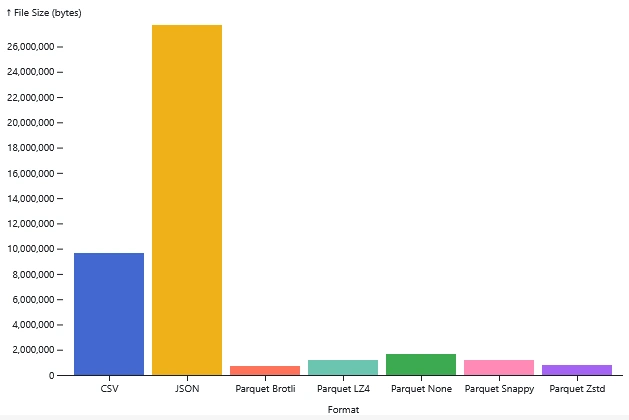
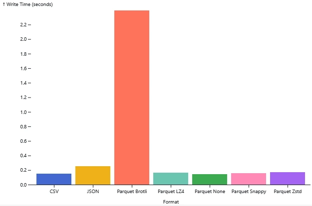
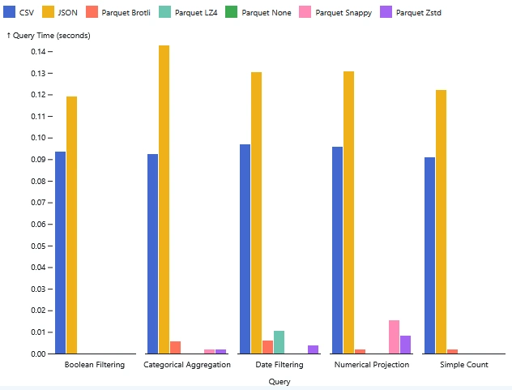

We all know DuckDB is fast. It feels like magic when you're working with
millions of rows, even on a laptop. But we often treat data storage as an
afterthought, dumping data into CSVs because they're universal, or JSON because
that's what the API uses. I wanted to find out if I was leaving free performance
on the table simply by saving my files in the wrong format.

So I took a standard dataset and ran it through DuckDB in multiple formats: CSV,
JSON, and five different compression flavors of Parquet. I measured write
speeds, file sizes, and query latency. The results were night and day.

## The Contenders & The Arena

For the data, I used a student assessment dataset with about 50,000 rows and
over 20 columns. It isn't massive, but it's real-world enough to be useful. It
contains a mix of integers, floats, booleans, and strings ranging from unique
IDs to repeated categorical values. This variety is key to seeing how different
formats handle actual data types.

The lineup included the classic CSV and JSON up against Parquet in five
different flavors: uncompressed, Snappy, Zstd, LZ4, and Brotli. The process was
straightforward. I loaded the data, exported it to every format to measure write
speeds and file sizes, and then hammered each file with five analytical queries
to see which one read the fastest.

## Round 1: File Size & Write Time

JSON was the heavyweight loser here, with a file size of nearly 28 MB due to its
verbose syntax. CSV fared better at roughly 10 MB, but Parquet was the clear
winner. Even without any compression, the columnar format shrank the dataset to
just 1.7 MB. That is the immediate power of storing data by column rather than
row. It doesn't repeat headers or padding every single value.

Adding standard compression algorithms like Snappy, LZ4, and Zstd barely
impacted write speeds. They all finished in about 0.16 seconds, which is
virtually the same as uncompressed. Zstd managed to compress the file down to a
tiny 800 KB. That's a 97% reduction in size compared to the JSON file, with
almost no penalty on write performance.

The only outlier was Brotli. While it won the file size competition by
compressing the data down to 720 KB, the cost was steep. The write time was
nearly 2.4 seconds. Unless you are archiving cold data and are desperate to save
every last bit of disk space, that massive write time probably isn't worth it.

## Round 2: Query Performance

When it came to querying, CSV and JSON hovered around 0.1 seconds. That's not
bad, but pretty slow for a database given the size. Parquet, on the other hand,
was instantaneous. Most queries completed faster than Python could clock them.

The secret is columnar storage. If I run a query on the `score` column, the CSV
reader has to scan every single row, parsing commas to find the right value.
Parquet just grabs the specific column data I asked for and ignores the rest.

Surprisingly, compression didn't slow things down much. I thought Zstd or Snappy
might lag due to decompression overhead, but they were just as fast as
uncompressed Parquet. The efficiency of reading smaller files from disk clearly
outweighs the minimal CPU cost required to unpack them.

## What Should You Use?

For almost any analytical workload, Parquet is the answer. Snappy (the default
in DuckDB) or Zstd compression hit the perfect balance between file size and
speed. You get tiny files and instant reads without the write penalty. Unless
you have a specific reason not to, make this your default.

If you need to share data with Excel or a human, CSV is fine. It's universal,
even if it's slower. But avoid JSON for analytics; it's too bloated. I'd only
use it if the communication contract between two services requires it.

## Smaller Files and Faster Queries

DuckDB is incredible, but don't forget that the storage format you choose
determines whether you get instant answers or wait around for I/O. Parquet with
Snappy or Zstd gets you smaller files and faster queries essentially for free.

Cover photo by [A Chosen Soul](https://unsplash.com/@a_chosensoul) on
[Unsplash](https://unsplash.com/photos/a-computer-generated-image-of-a-wave-of-green-ribbon-EyV0RZW9OrQ).
