VirtualBox is as a powerful tool to create and manage virtual machines. Using it, you may often encounter scenarios where you need to establish communication between the host and virtual machines, and this is where port forwarding comes into play. In this guide, we will explore the concept of port forwarding in VirtualBox. We’ll walk step-by-step through the configuration process, learn how to connect to your virtual machine, reference a list of commonly forwarded ports, and (for an alternative to port forwarding) show how to use a bridged adapter. By the end, you'll be equipped with the knowledge to set up and use port forwarding on your virtual machines.

By default, virtual machines running inside VirtualBox use a virtual network adapter attached to NAT. This means that the machine is not accessible on your host network, but rather a virtual network inside of the host computer. Any time you need to connect to your virtual machine remotely (whether by SSH, HTTP, or another protocol), you'll need to make sure the appropriate port is forwarded from your host machine. Here's how to do that.

Open **Oracle VM VirtualBox Manager** on the host machine.

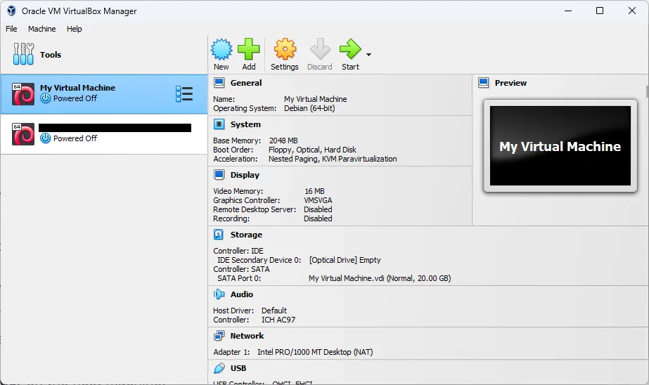

Click to select the virtual machine from the list on the left.

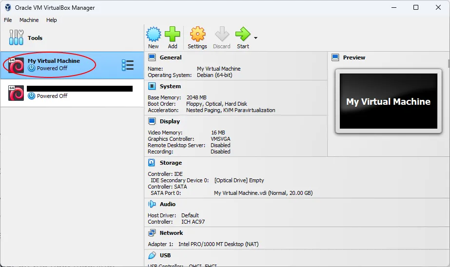

Click the **Settings** button.

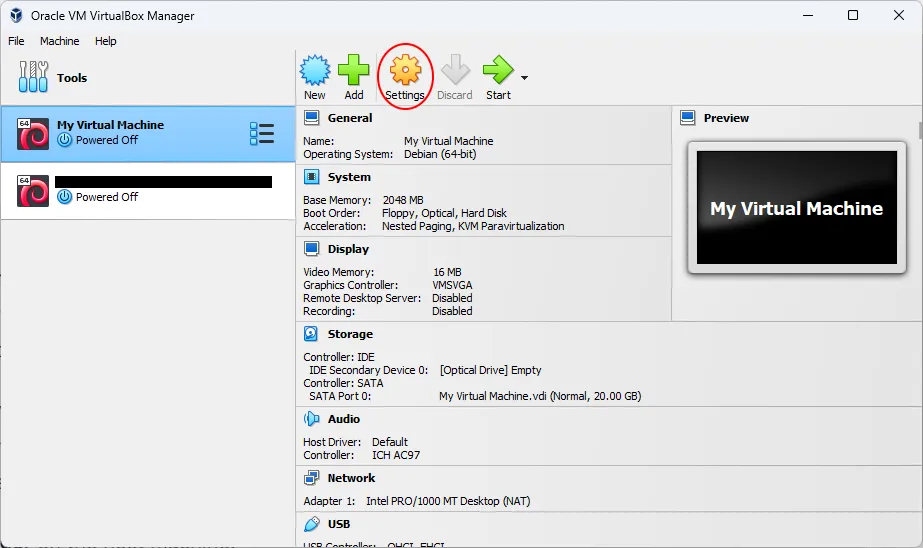

Click **Network** from the pane on the left.

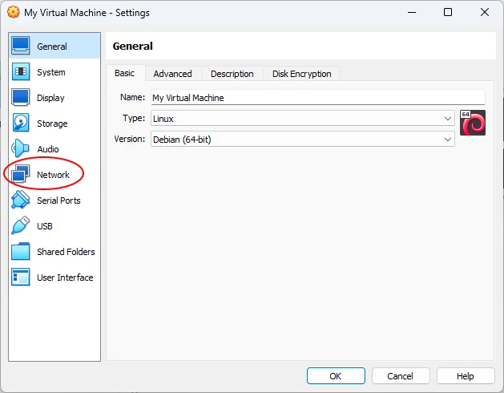

Under the **Adapter 1** tab, click **Advanced**.

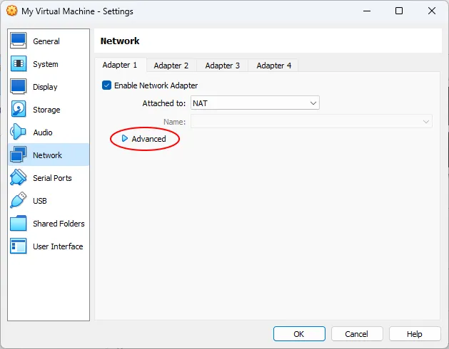

Click **Port Forwarding**.

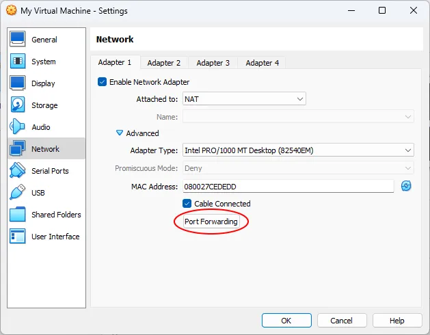

Click the **Adds new port forwarding rule.** button. It's on the right side.

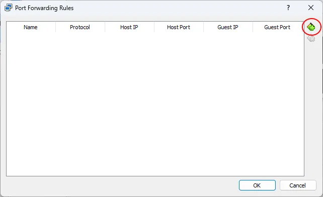

In the table on the left, double-click **Rule 1**. This will allow you to edit the name of the rule. Type in the name of the service. For example, **SSH**.

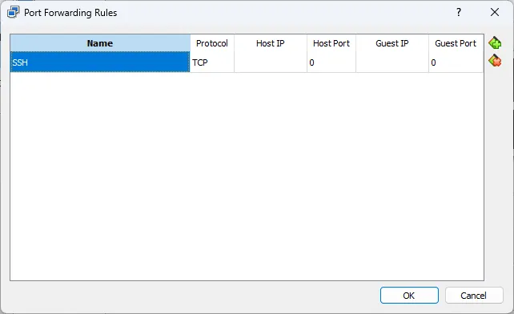

Under **Host Port**, enter the port number you want the host machine to listen on. This can be anything, but for simplicity, I recommend using the same as the guest port. For SSH, use port **22**.

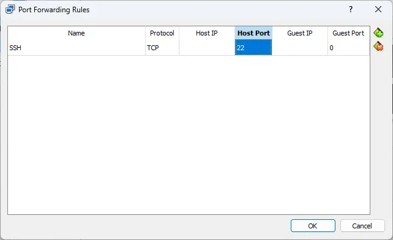

> If you have multiple virtual machines which you will be SSHing into, or you already have an SSH server running on the host machine itself, you may want to enter a different **Host Port**. In that case, choose any number you like between 1024 and 49152. Just make sure it is not in use by any other service.

Under **Guest Port**, enter the port number that your virtual machine is listening on. For SSH, use port **22**.

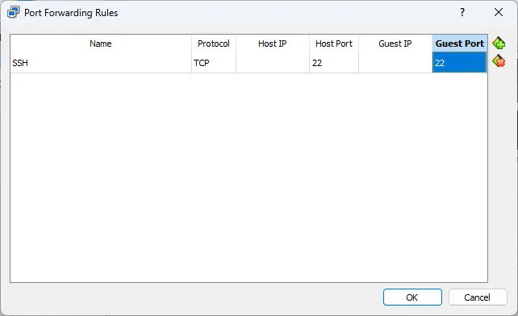

Leave everything else blank.

Click **OK**.

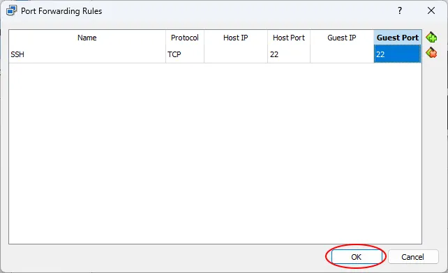

Click **OK** again.

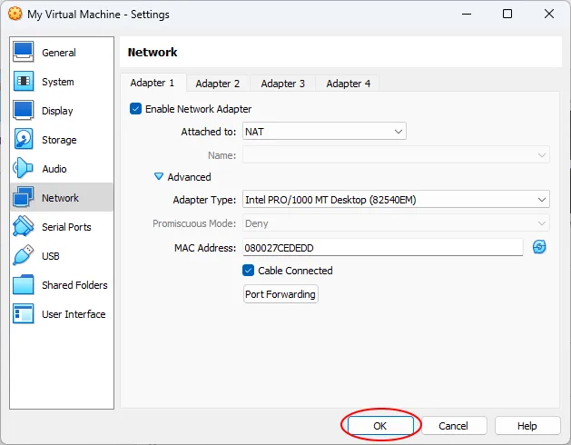

## Using the Forwarded Port

Now, if you want to SSH into the virtual machine from the host machine, you can use something like this:

```bash
ssh username@localhost
```

Make sure to change `username` to the actual username that is set up on your virtual machine.

If you want to connect to the virtual machine from some other machine than the host, try something like this:

```bash
ssh username@host_ip_address
```

Change `username` to the actual username and change `host_ip_address` to the host's actual IP address. On Windows, you can determine this from the `ipconfig` command.

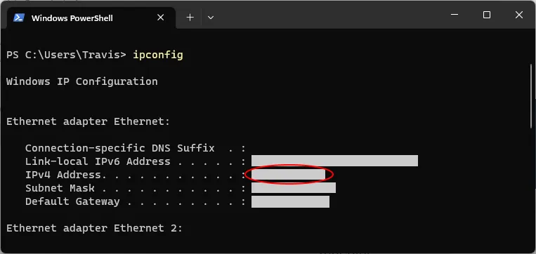

## Other Ports to Forward

Some common ports you may consider forwarding are...

* Port 21 for FTP
    
* Port 22 for SSH
    
* Port 80 for HTTP traffic
    
* Port 443 for HTTPS traffic
    
* Port 3000 which is a common development port for things like Node.js
    
* Port 3306 for MySQL/MariaDB access
    

## An Alternate Solution: Setting up a Bridged Adapter

If you want to access the virtual machine but don't want to forward any ports, you could attach the virtual network adapter to a bridged adapter. This places the virtual machine directly on the network with your other devices. It will receive its own IP address via DHCP.

Open **Oracle VM VirtualBox Manager** on the host machine.


Click to select the virtual machine from the list on the left.


Click the **Settings** button.


Click **Network** from the pane on the left.


Select **Bridged Adapter** from the **Attached to** dropdown menu.

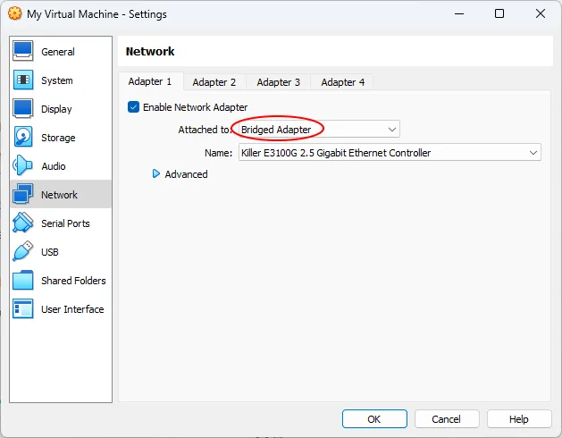

Click **OK**.


### Using a Bridged Adapter

First, you need to determine what IP address the virtual machine received via DHCP. This can most easily be done on the virtual machine.

On Linux, you can use `ip addr show`.

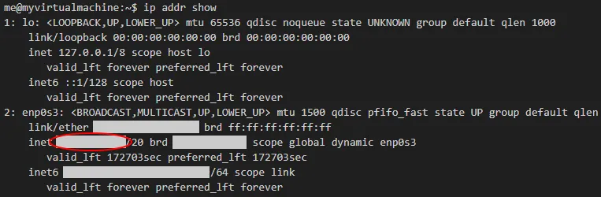

Now you can connect (via SSH, for example) to the machine using the virtual machine's IP address you just discovered.

```bash
ssh username@vm_ip_address
```

Hopefully now you better understand how to connect your virtual machines to the outside world. Through the step-by-step configuration process, we have simplified the process of port forwarding, making it accessible to users of all levels. We also explored some common ports, discovering which services can benefit from port forwarding, and even showed a bridged adapter as an alternative solution.

Cover photo by [Danielle Suijkerbuijk](https://unsplash.com/@vandaantje?utm_source=unsplash&utm_medium=referral&utm_content=creditCopyText) on [Unsplash](https://unsplash.com/photos/a-green-wall-with-a-plant-in-front-of-it-66ydMRXW-b8?utm_source=unsplash&utm_medium=referral&utm_content=creditCopyText).