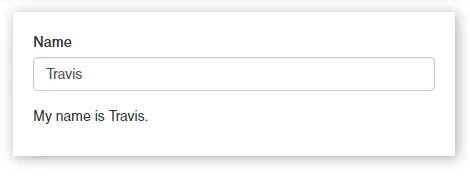
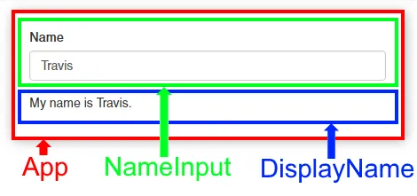

One of the first patterns that you will need to learn when working with React is passing data between classes. Let's look at how to do this by creating a simple "app" provides a text input and then displays the value of that input somewhere else.

### What we'll be building



To get started, we'll just need to make sure React is part of our environment. The correct way to do this for production would be to set up a build pipeline with a package manager like [npm](https://www.npmjs.com/), a bundler like [webpack](https://webpack.github.io/), and a compiler like [Babel](https://babeljs.io/). But for beginners in the learning stages, you can easily include React with the following boilerplate HTML:

```html
<!DOCTYPE html>
<html lang="en">
  <head>
    <meta charset="utf-8">
    <meta http-equiv="x-ua-compatible" content="ie=edge">
    <meta name="viewport" content="width=device-width, initial-scale=1">

    <title>Passing Data in React</title>
  </head>
  <body>
    <div id="app"></div>

<script src="https://npmcdn.com/react@15.3.0/dist/react.min.js"></script>
    <script src="https://npmcdn.com/react-dom@15.3.0/dist/react-dom.min.js"></script>
    <script src="main.js"></script>
  </body>
</html>
```


Notice the line…

```html
<div id="app"></div>
```


This is the target element where we'll tell React to place our app. The cool thing is that, if you have a currently existing website, you can place this element anywhere to start building React into your site.

Our simple app will be a React class with two nested React classes: One for the input and one for the display.



We need to pass data back and forth between `NameInput` and `DisplayName`. This can be done because they are both children of the `App` class.

We're going to write JSX code in a file name main.jsx and have Babel compile this to main.js

We'll create the `NameInput` class first. In main.jsx:

```jsx
var NameInput = React.createClass({
  render: function() {
    return (
      <div>
        <label for="name">Name</label>
        <input id="name" value={this.props.name} onChange={this.props.onChange} />
      </div>
    );
  },
});
```


The only function this class has is the `render()` function. React will execute this when rendering the class. It simply returns some JSX that displays a label and a text input.

The text input contains two interesting attributes. The `value` is set to the class's `name` property. The `onChange` property is set to execute the class's `onChange()` function.

But wait! The `NameInput` class doesn't have an `onChange()` function. Don't worry, we'll pass this as a property to the class later.

Keep in mind that the goal is to have the value of this input passed to the `DisplayName` class. Let's work on it now. Also in main.jsx:

```jsx
var DisplayName = React.createClass({
  render: function() {
    return (
      <p>My name is {this.props.name}.</p>
    );
  },
});
```


This class is even simpler. It also only uses the `render()` function. And it just returns a paragraph element that contains "My name is" followed by the `name` property. This property is the one that we want to be passed in from the `NameInput` class.

The third and final class is the most complex. It's the `App` class. Our previous two classes will be nested inside of it. In main.jsx, start off by writing…

```jsx
var App = React.createClass({
  getInitialState: function() {},

  changeName: function() {},

  render: function() {},
});
```


You'll notice that, in addition to the `render()` function, this class contains a `getInitialState()` function for initializing state (where our data is stored) and a `changeName()` function for updating the state.

Now, let's fill in `getInitialState()`:

```jsx
getInitialState: function() {
  return {
    name: this.props.name,
  };
},
```


It simply returns an object with a `name` key. The value of `name` comes from a property we'll pass to it later.

Now we'll write `changeName()`:

```jsx
changeName: function(event) {
  this.setState({ name: event.target.value });
},
```


This function will update the state's `name` property. It sets it to the value of target element that called the event. In the next step — the `render()` function — we'll make sure that the target element is our text input. This is where all the "tying together" is done:

```jsx
render: function() {
  return (
    <div>
      <NameInput name={this.state.name} onChange={this.changeName} />
      <DisplayName name={this.state.name} />
    </div>
  );
},
```


Upon render, we tell react to display our `NameInput` and `DisplayName` classes.

We give `NameInput` a `name` attribute and an `onChange` attribute. `name` is set to the state's `name` property, while `onChange` is set to the `changeName()` function. Now, our text input will know what to do *on change*.

We also give `DisplayName` the same `name`. Since both the `NameInput` and `DisplayName` are set to the same `name`, they will always display the same thing. They share the same source of data, which is the state of their parent.

The final piece is to actually render our app into the target element:

```jsx
ReactDOM.render(
  <App name="Travis" />,
  document.getElementById('app')
);
```


The first argument is the class to insert and the second argument is where to insert it. I'm giving our `App` class a default `name`, as well.

Here's what the completed main.jsx looks like:

```jsx
var NameInput = React.createClass({
  render: function() {
    return (
      <div className="form-group">
        <label for="name">Name</label>
        <input id="name" value={this.props.name} onChange={this.props.onChange} />
      </div>
    );
  },
});

var DisplayName = React.createClass({
  render: function() {
    return (
      <p>My name is {this.props.name}.</p>
    );
  },
});

var App = React.createClass({
  getInitialState: function() {
    return {
      name: this.props.name,
    };
  },
  
  changeName: function(event) {
    this.setState({ name: event.target.value });
  },
  
  render: function() {
    return (
      <div>
        <NameInput name={this.state.name} onChange={this.changeName} />
        <DisplayName name={this.state.name} />
      </div>
    );
  },
});

ReactDOM.render(
  <App name="Travis" />,
  document.getElementById('app')
);
```


The last step is to compile our JSX code in main.jsx to plain JavaScript so the browser can run it. There are so many ways to do this, but for a beginner, you can simply install Babel's CLI globally and the JSX transformer to your local project. In the terminal (or command prompt), make sure you are in the same directory as main.jsx, then run…

```console
npm install -g babel
npm install babel-plugin-transform-react-jsx
```


To compile, run…

```console
babel --plugins transform-react-jsx main.jsx > main.js
```


You should see a new file named main.js that contains plain JavaScript. Now open the HTML file and you‘ll see our completed app.

Again, both the `NameInput` and `DisplayName` classes use the same source of data: their parent's (the `App` class) state. This is how data can be "passed" in React.


Going forward, you'll need to run…

```console
babel --plugins transform-react-jsx main.jsx > main.js
```

…every time you update main.jsx. You can see how this would be a pain, especially if your app grows and you have multiple JSX files. At this point, the easiest solution is to create a package.json (using `npm init`) and make this command a "script." Like so:

```json
{
  "name": "passing-data-in-react",
  "version": "1.0.0",
  "devDependencies": {
    "babel-cli": "^6.18.0",
    "babel-plugin-transform-react-jsx": "^6.8.0"
  },
  "scripts": {
    "build": "babel --plugins transform-react-jsx main.jsx > main.js"
  }
}
```


With the script defined, the command to build is shortened to…

```console
npm run build
```


If you find yourself adding more and more build steps, even npm scripts start to get out of hand. At this point, many people would move to a bundler like [webpack](https://webpack.github.io/). It's very popular for React development. The official [Getting Started tutorial](https://webpack.js.org/get-started/) is very nice.
