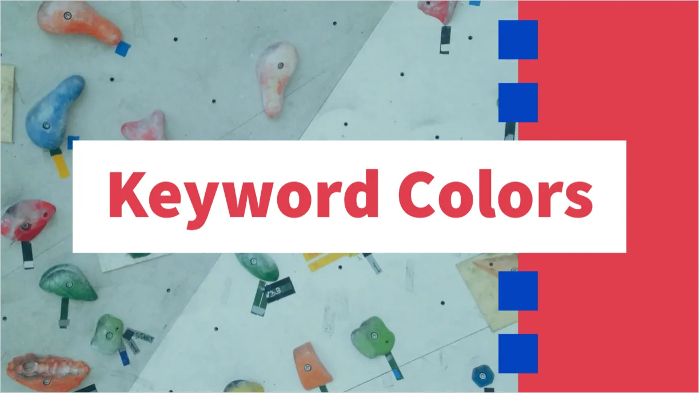
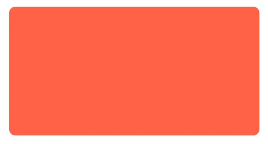
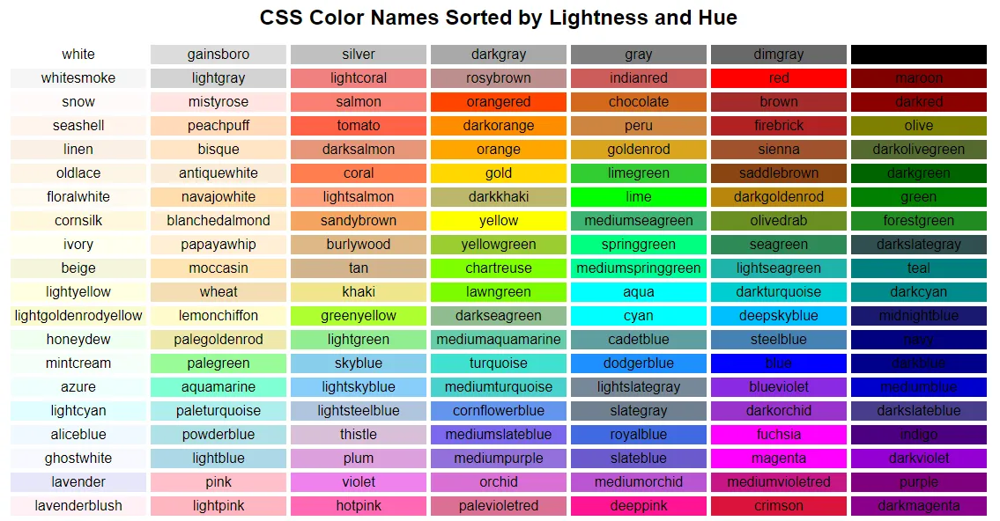
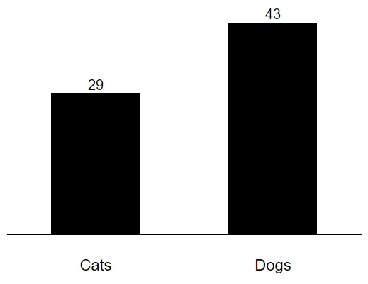
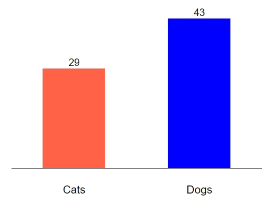
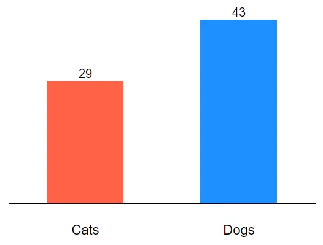
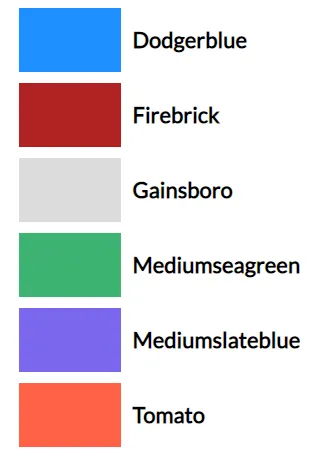

When quickly creating prototypes, color may play an important role. Especially for things like data visualization. However, choosing colors can be a time consuming processes. In the case of prototyping, one may pick colors quickly and tweak them later. One method of choosing colors quickly is to use CSS keyword colors.



Colors in CSS can be described a few different ways:

* Hexadecimal string notation: `#FF6347`

* RGB functional notation: `rgb(255, 99, 71)`

* HSL functional notation: `hsl(9, 72, 64)`

* Keyword: `tomato`

*All of the methods above describe the same color*

Let's focus on the last method: keyword.

MDN web docs [define CSS keyword colors](https://developer.mozilla.org/en-US/docs/Web/HTML/Applying_color#Keywords) as…
> A set of standard color names have been defined, letting you use these keywords instead of numeric representations of colors if you choose to do so and there's a keyword representing the exact color you want to use.

David Bau hosts [an awesome resource for finding these keyword colors](http://davidbau.com/colors/).



I love how his list is sorted by lightness and hue so you can find like colors quickly.

If I'm designing a simple bar chart…



…and I want to give it some color right away, I can look over the keyword list and find a couple I think might work.

```
.bar-cats { fill: tomato; }
.bar-dogs { fill: blue; }
```




Just taking a quick glance at this, I think the blue is too harsh and I'd like to soften it. So I can look at the list and see a nearby blue I think might work.

```
.bar-cats { fill: tomato; }
.bar-dogs { fill: dodgerblue; }
```




Later, I may tweak these even further using more specific hex codes but for now the prototype looks good.

%[https://codepen.io/travishorn/pen/dqxaXW]

Besides some of the basic colors like black, white, red, etc. I've memorized a few keyword colors in different hues that I like to reuse when prototyping a new design. Some of these include:



These allow me to get up and running quickly with a colorful design. Which keyword colors do you think look good when quickly prototyping a design? Or do you use another system like memorizing hex codes or using a color picker in your IDE?