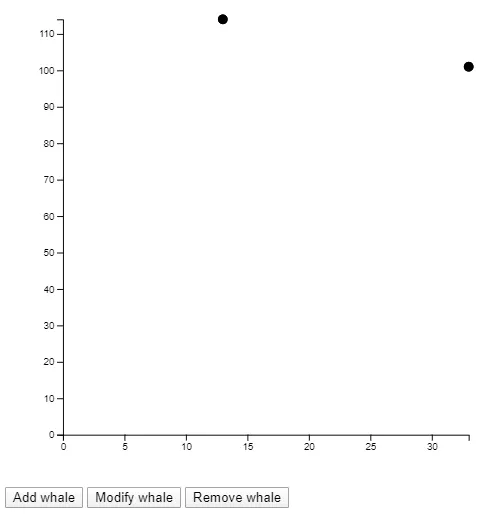

D3 provides a powerful interface for reacting to changes in data. When hooked up
to Vue, you can create data visualizations that react to your UI or even remote
data sources.

Follow along and we'll build a chart that updates when new data points are added
and when existing data points are modified or removed.


To get started, let's make a tiny page with some bare-bones HTML and an `<svg>`
element. Make sure the `<svg>` has an `id`.

```html
<!doctype html>
<html lang="en">
  <head>
    <meta charset="utf-8" />
    <title>Chart</title>
  </head>
  <body>
    <svg id="chart" viewBox="0 0 500 500"></svg>
  </body>
</html>
```

Since we'll be using [Vue.js](https://vuejs.org/) and
[D3.js](https://d3js.org/), let's make sure to include them. Ideally, you'd be
using a build step to pull in these dependencies and bundle them. But for now,
simple `<script>` tags will work.

Below the `<svg>` tag, add the scripts.

```html
<script src="https://cdnjs.cloudflare.com/ajax/libs/vue/2.6.11/vue.min.js"></script>
<script src="https://cdnjs.cloudflare.com/ajax/libs/d3/5.15.0/d3.min.js"></script>

<script>
  // Our code can go here
</script>
```

For this tutorial, we'll plot some _fake_ data regarding blue whales; starting
with a very small sample size.

```javascript
const whales = [
  { age: 13, weight: 114 },
  { age: 33, weight: 101 },
  { age: 52, weight: 139 },
];
```

Before we make it reactive, let's focus on just getting a static chart built. A
[scatter plot](https://en.wikipedia.org/wiki/Scatter_plot) would be a good way
to visualize this data.

Start with some dimensions.

```javascript
const width = 500;
const height = 500;
const margin = {
  top: 20,
  right: 20,
  bottom: 50,
  left: 60,
};
```

Use these dimensions to place a `<g>` element that respects our margins. All
other chart elements will be placed inside this `<g>`, so we'll call it our
`chart`.

```javascript
const chart = d3
  .select("#chart")
  .append("g")
  .attr("transform", `translate(${margin.left}, ${margin.top})`);
```

Next, we'll need some scales. The x axis will plot our whale ages. A linear
scale works well for this kind of data.

The `range` of this scale is the width of our chart (minus the margins we set).

```javascript
const x = d3.scaleLinear().range([0, width - margin.left - margin.right]);
```

If you know anything about D3.js, you may be expecting the `domain` to be set at
this time, as well. I'm intentionally omitting it for right now because I only
want to set chart values that _don't_ change with the data. Domains react to
data changes. Ranges do not.

The y axis will plot our whale weights. A linear scale also works well here.

The `range` of _this_ scale is the _height_ of our chart.

```javascript
const y = d3.scaleLinear().range([height - margin.top - margin.bottom, 0]);
```

Notice the first value of the y scale is the height, and the second value is 0.
We want heavier weights at the top of the chart, and zero at the bottom.

Now let's make some elements into which we can place the axes. We wont actually
be placing the axes on the chart at this point, just the placeholder `<g>`s for
them. Axes are another element that react to changes in data. If a new data
point gets added where the age is older than any existing age in the chart, the
x axis will have to adjust. Likewise for the y axis with weights.

```javascript
const xAxis = chart
  .append("g")
  .attr("transform", `translate(0, ${height - margin.top - margin.bottom})`);

const yAxis = chart.append("g");
```

Notice the `xAxis` is shifted down so it's at the bottom of the chart. The
`yAxis` doesn't need to be shifted because it starts at the upper left corner of
the chart anyway.

With all of the static elements and values taken care of, it's time to code the
parts of the chart that react to data changes.

Place all of this code in a new function we'll call `plot()`.

```javascript
const plot = () => {
  // Code to plot data goes here.
};
```

The first thing to do inside this function is set the domain of our scales.

```javascript
x.domain([0, d3.max(whales, (d) => d.age)]);
y.domain([0, d3.max(whales, (d) => d.weight)]);
```

Now we can call our axes and finally get some visual result on our page.

```javascript
xAxis.call(d3.axisBottom(x));
yAxis.call(d3.axisLeft(y));
```

Let's see what this looks like on our page. Immediately after defining the
`plot()` function, call it.

Note that this function call goes **outside** the function definition itself.

```javascript
plot();
```


There's only one more declaration we have to make in order to place dots on this
chart.

Back inside the `plot()` function, add the code for appending `<circle>`
elements.

```javascript
chart
  .selectAll(".point")
  .data(whales)
  .join("g")
  .attr("class", "point")
  .attr("transform", (d) => `translate(${x(d.age)}, ${y(d.weight)})`)
  .append("circle")
  .attr("r", 5);
```

If you are not familiar with D3.js and you're confused by the code above, you
may consider reading up on [D3 data
joins](https://observablehq.com/@d3/selection-join).

Basically, we're binding all elements with a `class` of `point` to our data. The
`.join()` here takes care of adding the appropriate elements if they don't yet
exist, modifying elements if they do, and removing extra elements if there's
more of them than there are data points. Once the elements and data are bound,
we add a `<circle>` with an `r` (radius) of 5 pixels for each one.

The chart is now mostly usable.


The way we've coded this chart makes it easy to update when data changes. Every
time `plot()` is called, the data is re-analyzed and the chart updates.

## Adapting the chart for use in Vue

This chart is great and all, but how is it usable in Vue.js?

Just to get started, let's wrap our `<svg>` in a new `<div>` to which we can
bind a Vue component.

```html
<div id="app">
  <svg id="chart" viewBox="0 0 500 500"></svg>
</div>
```

Back in the JavaScript, define a new Vue instance.

```javascript
new Vue({
  el: "#app",
  data: {},
  watch: {},
  methods: {},
  mounted() {},
});
```

Now cut **all** of the other JavaScript we've written so far and paste it into
the `mounted()` function.

```javascript
new Vue({
  el: "#app",
  data: {},
  watch: {},
  methods: {},
  mounted() {
    const whales = [
      /* ... snip ... */
    ];
    const width = 500;
    /* ... snip ... */
    plot();
  },
});
```

To keep the article concise, I've snipped out a lot of the code we've already
written.

The result in the browser at this point should be the same as before we started
writing any Vue code.

Now we'll move some data and functions into their respective Vue environments.
`whales` is a data variable, so move it into the `data` property.

```javascript
data: {
  whales: [
    { age: 13, weight: 114 },
    { age: 33, weight: 101 },
    { age: 52, weight: 139 }
  ]
},
```

Once you remove `const whales = [ ... snip ... ]` from the `mounted()` function,
the chart will break. To fix it, find all references to `whales` and change them
to `this.whales`. This will make each reference look in the view-model's `data`
attribute.

The `plot()` function should become a Vue method, so cut and paste it into the
`methods` property.

```javascript
methods: {
  plot() {
    x.domain([0, d3.max(this.whales, d => d.age)]);
    y.domain([0, d3.max(this.whales, d => d.weight)]);

    /* ... snip ... */
  }
},
```

Don't forget to update the call to `plot()` to `this.plot()`.

Even updating the call to `this.plot()`, the chart is still broken. Looking at
the error in the console, I see:

```
ReferenceError: x is not defined
  at wn.plot
  at wn.mounted
```

Aha! The `plot()` method cannot access our `x` scale because it's declared in
the `mounted()` function's scope. Looking at the rest of the code, I can see
we'll run into the same issue with all of these variables:

- `x`
- `y`
- `xAxis`
- `yAxis`
- `chart`

Update all of those those declarations so they're `data` attributes. In
practice, this means changing all of these:

```javascript
const chart = /* .. snip .. */
const x = /* .. snip .. */
const y = /* .. snip .. */
const xAxis = /* .. snip .. */
const yAxis = /* .. snip .. */
```

To this:

```javascript
this.chart = /* .. snip .. */
this.x = /* .. snip .. */
this.y = /* .. snip .. */
this.xAxis = /* .. snip .. */
this.yAxis = /* .. snip .. */
```

With the declarations taken care of, now you must update all references to any
of the above variables to `this.x` and `this.y`, etc.

For example, in `plot()`, the first line says:

```javascript
x.domain([0, d3.max(this.whales, (d) => d.age)]);
```

This should be changed to:

```javascript
this.x.domain([0, d3.max(this.whales, (d) => d.age)]);
```

Do this for all references to `chart`, `x`, `y`, `xAxis`, and `yAxis`. When
you're finished, you should see the chart on your page once again.

Finally, we just need to write a simple piece of code that will cause the
`plot()` method to be called whenever `whales` changes. A [Vue
watcher](https://it.vuejs.org/v2/guide/computed.html#Watchers) works well here.

```javascript
watch: {
  whales: {
    deep: true,
    handler() { this.plot(); }
  }
},
```

This code watches the `whales` data property and calls the `plot()` method any
time it or any of its values changes.

To test this out, you can add a button that adds a new whale.

```html
<button @click="addWhale">Add whale</button>
```

Make sure the button is a child of `<div id="app">` so it's part of the Vue app.

Now add a method that pushes a new randomly generated whale data point.

```javascript
methods: {
  plot() { /* .. snip .. */ },
  addWhale() {
    this.whales.push({
      age: Math.random() * 80,
      weight: Math.random() * 200
    });
  }
},
```

If you click the button, you see another data point added to the chart.


If you click it enough times, you'll probably get one that has an age or weight
outside the bounds of our original three. In that case, you can see the chart
update to accommodate the new maximum values.


How about modifying and removing existing data points. You can create two new
buttons.

```html
<button @click="modifyWhale">Modify whale</button>
<button @click="removeWhale">Remove whale</button>
```

And two new methods.

```javascript
modifyWhale() {
  if (this.whales.length > 0) {
    const i = Math.floor(Math.random() * this.whales.length);
    this.whales[i].age = Math.floor(Math.random() * 80);
    this.whales[i].weight = Math.floor(Math.random() * 200);
  }
},
removeWhale() {
  if (this.whales.length > 0) {
    const i = Math.floor(Math.random() * this.whales.length);
    this.whales.splice(i, 1);
  }
}
```

Clicking "Modify whale" changes a random data point.


Clicking "Remove whale" removes a random one.



That's it! You can build any form of interactivity into your Vue app. Any time
the chart data changes, the chart updates. You could even have your data hooked
up to a remote source that gets updated through
[fetch](https://developer.mozilla.org/en-US/docs/Web/API/Fetch_API),
[websockets](https://developer.mozilla.org/en-US/docs/Glossary/WebSockets), or
an [EventSource](https://developer.mozilla.org/en-US/docs/Web/API/EventSource).

## Adding some missing details

While not directly in the scope of this article, it's important that we label
our data. I added a title to the HTML.

```html
<div id="app">
  <h1>Blue Whales</h1>
  <svg id="chart" viewBox="0 0 500 500"></svg>
  <button @click="addWhale">Add whale</button>
  <button @click="modifyWhale">Modify whale</button>
  <button @click="removeWhale">Remove whale</button>
</div>
```

And I added axis labels using D3. This code goes in the `mounted()` section.

```javascript
this.chart
  .append("text")
  .attr("font-size", 10)
  .attr("text-anchor", "middle")
  .attr("x", (width - margin.left - margin.right) / 2)
  .attr("y", height - margin.top - margin.bottom + 40)
  .text("Age (years)");

this.chart
  .append("text")
  .attr("font-size", 10)
  .attr("text-anchor", "middle")
  .attr("transform", "rotate(-90)")
  .attr("x", 0 - (height - margin.top - margin.bottom) / 2)
  .attr("y", -40)
  .text("Weight (tons)");
```

[The finished product (with a small set of CSS styles) can be found on
CodePen.](https://codepen.io/travishorn/pen/gOpXwXV)
