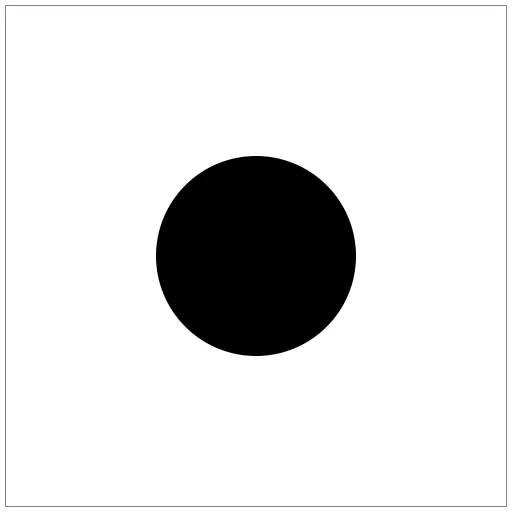
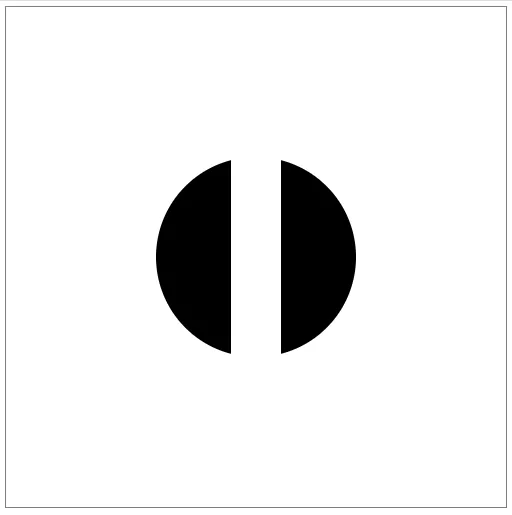
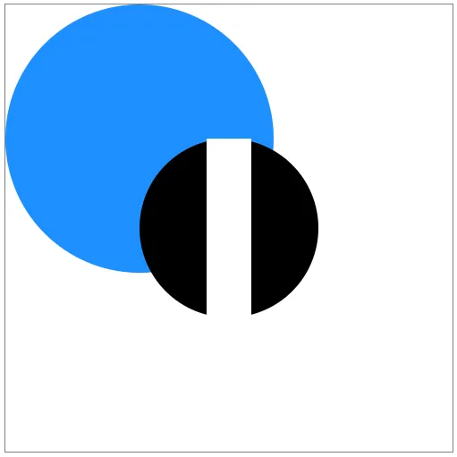
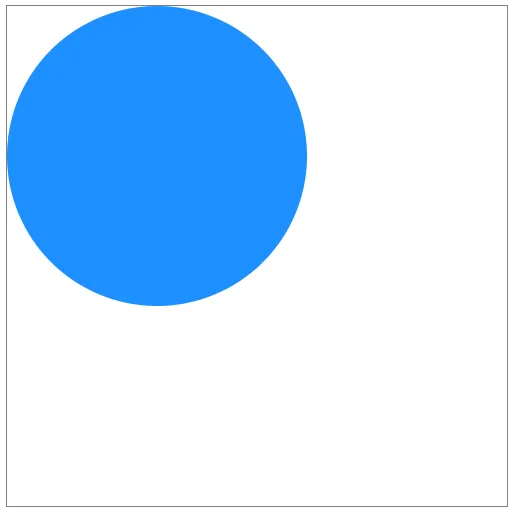
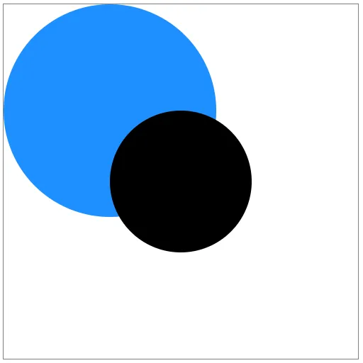
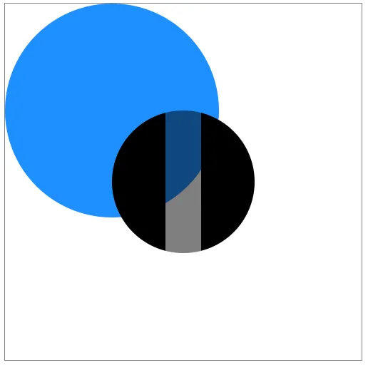
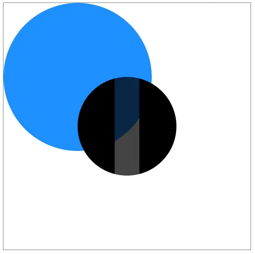
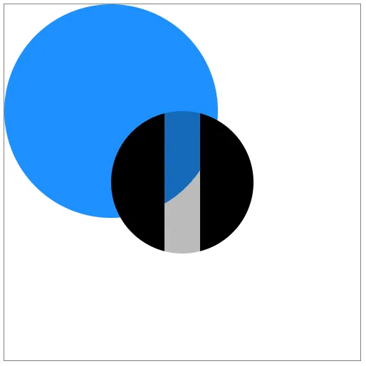
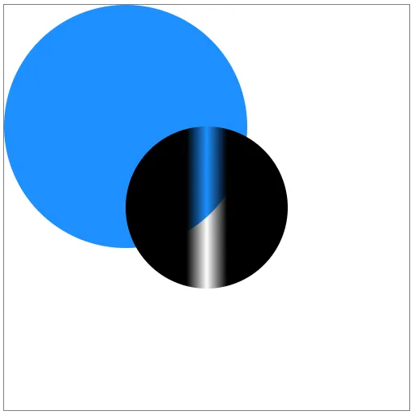

Recently, I needed to remove part of a shape in SVG for a project I was working on. Using clipping paths and masks are not as intuitive as I had first hoped. I figured it out and documented the process here.


This is the desired end result. Notice the black circle has a stripe taken out of it and you can see everything "underneath" it.


### Setup

First, let's start with a basic SVG canvas and a circle.

```
<svg viewBox="0 0 500 500">
  <circle cx="250"
          cy="250"
          r="100" />
</svg>
```




### First attempt

Say you want to remove a vertical stripe in the middle of this circle. Your first thought may be to layer a white rectangle over the top.

```
<rect x="225"
        y="0"
        width="50"
        height="500"
        fill="white" />
```


And it works.



### A problem

But only if your background is pure white. If you have any other shapes, this method becomes a problem.

For example, if we had another circle "below" the first one…

```
<circle cx="150"
        cy="150"
        r="150"
        fill="dodgerblue" />
```


…the white stripe would cover that circle up as well.


You could try to adjust the stripe.

```
<rect x="225"
      **y="150"**
      width="50"
      **height="200"**
      fill="white" />
```


But you could never get it perfect.



### Solution

Instead what you need is a mask.

First, remove the stripe. Here's the full HTML without it:

```
<svg viewBox="0 0 500 500">
  <circle cx="150"
          cy="150"
          r="150"
          fill="dodgerblue" />
  <circle cx="250"
          cy="250"
          r="100" />
</svg>
```


Next add a `&lt;defs&gt;` section inside the `&lt;svg&gt;` and place a `&lt;mask&gt;` inside that.

```
<defs>
  <mask id="stripe">
    
  </mask>
</defs>
```


It's not set up yet, but go ahead and add the mask to the black circle.

```
<circle cx="250"
        cy="250"
        r="100"
        mask="url(#stripe)" />
```


The circle disappeared!



That's because the mask cuts out everything that's not white *in the mask*.

Add a white rectangle to the entire canvas **inside the mask**.

```
<mask id="stripe">
  <rect x="0"
        y="0"
        width="500"
        height="500"
        fill="white" />
</mask>
```


The circle is back now.



The big white rectangle doesn't show up because it's not actually on the canvas, it's inside a mask.

The circle still has the mask applied to it, but the mask is simply showing *everything* because it's just a big white rectangle. Masks show everything white and hide everything black.

With that knowledge, let's add a black stripe to the mask.

```
<rect x="225"
**      **y="150"
      width="50"
      height="200" />
```


This rectangle is very similar to our first approach. Except it's black instead of white and inside a mask instead of being a regular shape.

The black circle now has the stripe taken out of it! Just as we wanted. And this time, everything behind it is still visible.


The full code and demonstration can be found in the pen below.


### Varying opacity

There is another feature of masks. Not only do they show everything white and hide everything black, they show everything gray with 50% opacity.

If you change the rectangle in the mask to be filled with gray…

```
<rect x="225"
      y="150"
      width="50"
      height="200"
      fill="gray" />
```


…the black circle shows up with a stripe of 50% opacity.



And it's not just one gray either. Every gray between white and black lets more or less of the masked shape through.

Less opacity:

```
<rect x="225"
      y="150"
      width="50"
      height="200"
      fill="#BBBBBB" />
```




More opacity:

```
<rect x="225"
      y="150"
      width="50"
      height="200"
      fill="#444444" />
```




Even gradient's work.

```
<mask id="stripe">
  **<linearGradient id="grayscale">
     <stop offset="0%" stop-color="white" />
     <stop offset="50%" stop-color="black" />
     <stop offset="100%" stop-color="white" />
   </linearGradient>**
   <rect x="0"
         y="0"
         width="500"
         height="500"
         fill="white" />
   <rect x="225"
         y="150"
         width="50"
         height="200"
         fill="**url(#grayscale)**" />
    </mask>
```


Notice I defined the gradient at the top, then referenced it in the `fill` attribute of the stripe.



The final code with gradient is in the pen below.

https://codepen.io/travishorn/pen/dQbrPE