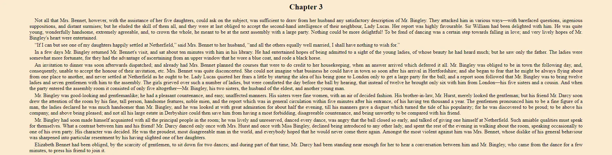
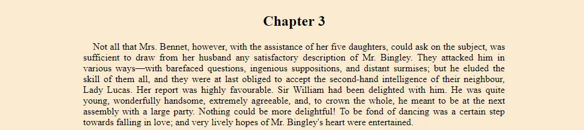
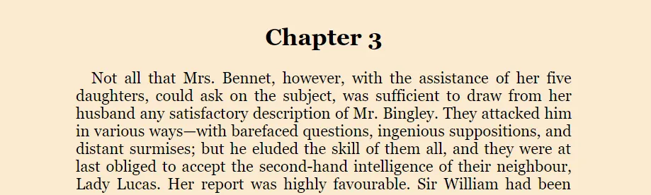
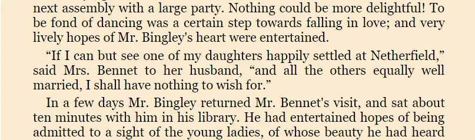
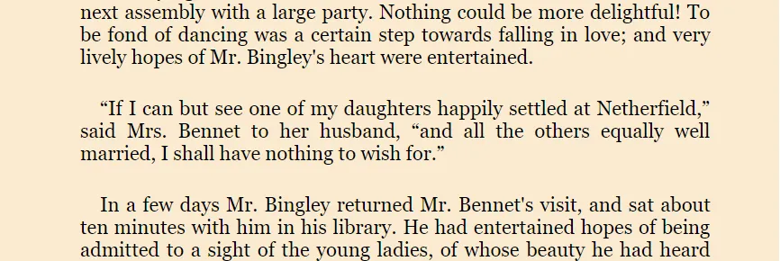
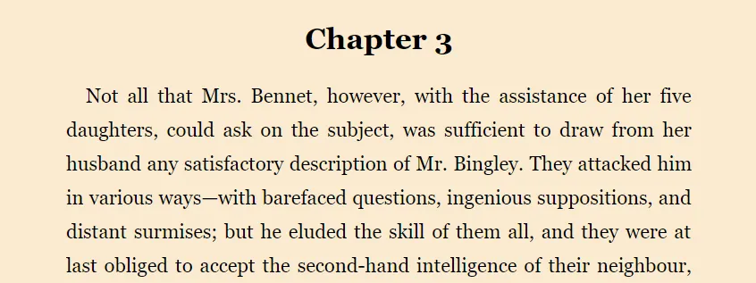
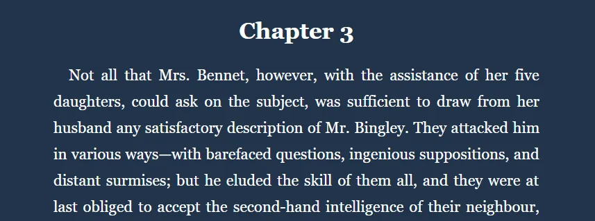

I enjoy reading books from Project Gutenberg. If you haven’t heard of this project, it’s a repository containing tens of thousands of free eBooks. You can find some of the world’s greatest literature on their site; Pride and Prejudice by Jane Austen, Ulysses by James Joyce, and Moby Dick by Herman Melville, just to name a few.


The site offers these books in multiple formats. Usually, you can find a book in [EPUB](https://en.wikipedia.org/wiki/EPUB), [MOBI](https://www.lifewire.com/what-is-a-mobi-file-2621997) (for Kindle), and a few other formats. They also offer HTML so you can read the book right in your browser.

You may find reading their HTML version more difficult than it has to be, for a few reasons.

## Maximum width

Reading a large amount of text can be difficult if the lines are very long.

*The beginning of Chapter 3 in Jane Austen’s *Pride and Prejudice**

When you reach the end of one line, your eyes have to move all the way back to the left and find the start of the next line. It sounds easy enough, but I find myself often re-reading the same line or accidentally skipping a line.

Shorter lines means your eyes can follow the lines easier and make less errors.

Adding `body { max-width: 700px; margin: 0 auto; }` solves this problem. It sets the maximum width to 700 pixels and centers the content on the page.

*Shorter lines = easier to follow*

## Small, default font

I use a common resolution and I sit a normal distance from my screen, but I still feel like the default font and font size make the text hard to read. Changing the font family and increasing the font size makes everything look better.

This can be done with `body { font-family: Georgia, Cambria, serif; font-size: 22px; }`.

*Larger, nicer font*

## Indistinct paragraphs

The paragraphs seem to run together. If it wasn’t for the (small) indentation at the beginning of each one, you couldn’t really tell where one ended and another began.

*Where are the paragraphs?*

Setting a bottom margin on paragraphs make sense. We can do that with `p { margin-bottom: 2rem; }`

*There they are!*

## Line height

A related issue; now that we’ve increased the space between paragraphs, it sticks out to me that the lines are too close together, as well. This can be fixed with `p { line-height: 1.75; }` . While double spacing isn’t quite necessary, 1 ¾ looks pretty good.

*Lines are easier to read with a little spacing.*

## Color choice

I think the colors they’ve chosen work nicely, but personally, I prefer a “night mode” light-on-dark.

```
body { background-color: #22344A; color: white; }
```


*A darker theme can give eyes some relief.*

## Where was I?

Finally, the HTML versions of these books are all single **long** web pages. I actually prefer it this way, except it has one big drawback: There’s no way to save your place and come back later.

This problem could be solved in many robust ways, such as implementing a bookmarking system. However, I have been getting by just fine with a few simple lines of JavaScript that saves my place so that the browser automatically scrolls down to where I left off when I re-open the page.

```
document.addEventListener('DOMContentLoaded', () => {
  const ns = 'pridePrejudice';
  const key = `saveScroll.${ns}`;

  const savePosition = () => {
    localStorage.setItem(key, window.scrollY);
  };

  const savedPosition = localStorage.getItem(key);

  if (savedPosition) window.scrollTo(0, savedPosition);

  window.addEventListener('scroll', savePosition);
});
```


Each time the page is scrolled, the Y (vertical) position is saved to [localStorage](https://developer.mozilla.org/en-US/docs/Web/API/Window/localStorage). When the page loads, it checks for this key. If found, the window is scrolled to that position.

The `ns` constant is just a namespace I give to that particular book. As long as you use a unique namespace for each book, multiple books can all have their positions saved.

## Using these tweaks

It would be excellent if Project Gutenberg implemented these changes to all their HTML eBooks by default. But until then, my favorite method is to save the `.html` file, open it in a text editor, and add the following lines at the bottom of the `&lt;head&gt;` section.

```
<style>
  body {
    max-width: 700px;
    margin: 0 auto;
    font-family: Georgia, Cambria, serif;
    font-size: 22px;
    background-color: #22344A;
    color: white;
  }
  p {
    margin-bottom: 2rem;
    line-height: 1.75;
  }
</style>
<script>
  document.addEventListener('DOMContentLoaded', () => {
    const ns = 'pridePrejudice';
    const key = `saveScroll.${ns}`;

    const savePosition = () => {
      localStorage.setItem(key, window.scrollY);
    };

    const savedPosition = localStorage.getItem(key);

    if (savedPosition) window.scrollTo(0, savedPosition);

    window.addEventListener('scroll', savePosition);
  });
</script>
```


*Remember to change the `*ns`* constant if you will be reading more than one book.*

I have a few books saved just like this on my computer so I can open them and start reading whenever I want, even without an internet connection.

Did you know Project Gutenberg never charges a fee? Everything on their site is completely free. And it’s thanks to the hard work of thousands of volunteers over more than 45 years.

If you get any benefit from this project, [consider donating](https://www.gutenberg.org/wiki/Gutenberg:Project_Gutenberg_Needs_Your_Donation) via PayPal, Flattr, check, or money order.