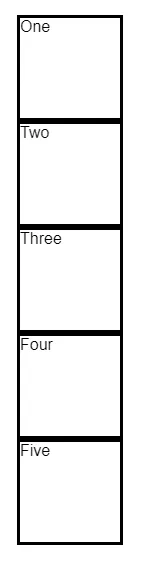
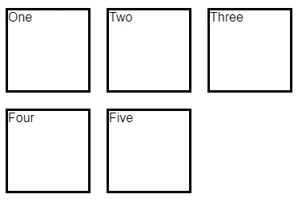
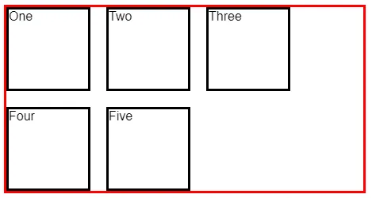
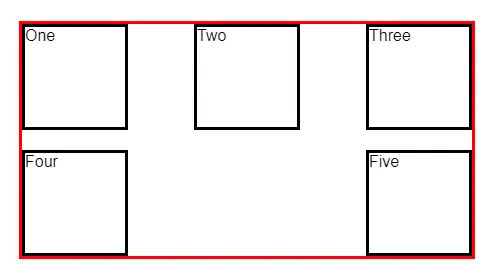
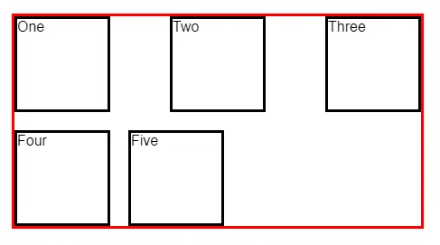
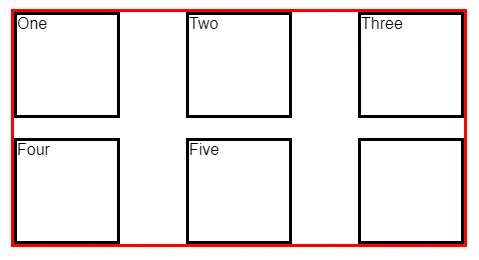
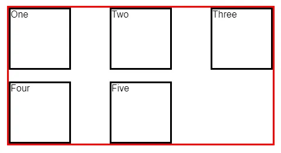
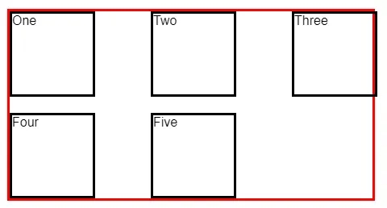
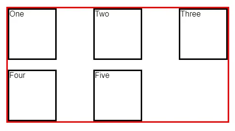

Using flexbox doesn't always produce the expected alignment, especially on the last row of a grid. When you use justify-content: space-between it will place a large gap in the last row unless there are a square number of items.


Say we have a collection of items.

```bash
<div class="container">
  <div class="item">One</div>
  <div class="item">Two</div>
  <div class="item">Three</div>
  <div class="item">Four</div>
  <div class="item">Five</div>
</div>
```

Each item has a fixed height and width.

```bash
.item {
  width: 100px;
  height: 100px;
  border: solid;
}
```



If you want to arrange them in a grid, you could use flexbox.

```bash
.container {
  width: 450px;
  display: flex;
  flex-wrap: wrap;
  gap: 20px;
}
```



This actually gives us the effect we are trying to achieve. But each row is too left-aligned. This becomes apparent when you can visualize the container.

```bash
.container {
  /* ... snip ... */
  border: solid red;
}
```



Many times, you will want to avoid that big gap on the right and justify each row so the items appear with even space between.

```bash
.container {
  /* ... snip ... */
  justify-content: space-between;
}
```



Now we have a new issue. There is space between each item in the row just like we defined, but it doesn't exactly look like what we might expect. It's a common design pattern to have the last row aligned to the left when there aren't enough items to fill it.

This is exactly the question on this Stack Overflow question and its many duplicates.

%[https://stackoverflow.com/questions/18744164/flex-box-align-last-row-to-grid/] 

The accepted answer uses `::after`.

```bash
.container::after {
  content: "";
  flex: auto;
}
```

But this doesn't look good at all when you're using fixed widths like we are here.



### Adding items to make the grid square

Instead of adding the `::after` block above, we can take another approach.

Add another item (or items) so that the grid is square. Give these items a specific class. See the last item below.

```bash
<div class="container">
  <div class="item">One</div>
  <div class="item">Two</div>
  <div class="item">Three</div>
  <div class="item">Four</div>
  <div class="item">Five</div>
  <div class="item item-empty"></div>
</div>
```



We can hide the item, too.

```bash
.item-empty {
  visibility: hidden;
}
```



This technique works well when you know how many items there are or you can calculate it and add items dynamically.

### Use CSS grid

One of my favorite approaches is to replace flexbox with grid.

Delete the empty items so we're left with the original set.

```bash
<div class="container">
  <div class="item">One</div>
  <div class="item">Two</div>
  <div class="item">Three</div>
  <div class="item">Four</div>
  <div class="item">Five</div>
</div>
```

Delete the flexbox CSS on `.container`. That means delete all of the following:

```bash
display: flex;
flex-wrap: wrap;
gap: 20px;
justify-content: space-between;
```

And add the following grid CSS.

```bash
.container {
  /* ... snip ... */
  display: grid;
  grid-template-columns: repeat(auto-fill, 100px);
  justify-content: space-between;
  grid-gap: 20px;
}
```



Since we are defining our columns as `100px` wide here, we can remove the following line from `.item`

```bash
width: 100px;
```

That leaves us with a nicely aligned grid with the last row left-aligned.



The code and live example for this post can be found in the pen below.

%[https://codepen.io/travishorn/pen/MWbzNWm]