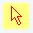

Tables might just be the most versatile format for displaying structured data.
They appear everywhere to display information in a way us humans can quickly
understand.

Tables in HTML are marked up using the following elements:

- `<table>` itself
- `<caption>` to represent the title of the table
- `<colgroup>` to define a group of columns
- `<thead>` to define a set of rows defining the head of the columns
- `<tbody>` to group one or more rows as the body
- `<tfoot>` to define a set of rows summarizing the columns
- `<tr>` to specify markup that comprises one row of a table
- `<th>` to define a cell as header of a group of other cells
- `<td>` to define a cell of a table that contains data

A simple table may be coded like so:

```html
<table>
  <caption>
    MLB 2016 Standings
  </caption>
  <thead>
    <tr>
      <th>Team</th>
      <th>Division</th>
      <th>Wins</th>
      <th>Losses</th>
      <th>Pct</th>
    </tr>
  </thead>
  <tbody>
    <tr>
      <th>Red Sox</th>
      <td>AL East</td>
      <td>93</td>
      <td>69</td>
      <td>.574</td>
    </tr>
    <!--- Plus many more <tr>s (rows) -->
  </tbody>
</table>
```

The appearance in most modern browsers looks something like this:


While not visually striking, it does show all of our information succinctly.

### The look & feel

It looks pretty cramped. Things start looking better immediately if we add some
padding to the cells.

```css
th,
td {
  padding: 7px 40px;
}
```


Adding a light horizontal line between rows is a popular design choice. It can
be done by collapsing table borders and adding a bottom border to all
`<tr>` elements.

```css
table {
  border-collapse: collapse;
}
tr {
  border-bottom: solid 1px #e6e6e6;
}
```

Setting `border-collapse: collapse` on `table` specifies that adjacent cells
share borders. By default, they have their own distinct borders from each other.


By default, the text inside `<th>` elements is centered. For headers in
the `<thead>`, forcing them to the left keeps them more in line with the
columns they represent.

For headers in the `<tbody>`, you could argue that there's no reason they
should even be centered in the first place.

```css
th,
td {
  text-align: left;
}
```


Left-aligned columns are a good default, but there is a strong advantage to
right-aligning numerical data: it aligns all of the numbers' places. The units,
tens, hundreds, etc. are all vertically aligned. This makes it easy to compare
the magnitude.

In our MLB standings table, columns 3, 4, and 5 contain numerical data.
Alignment can be done with the `:nth-child()` selector.

```css
td:nth-child(3),
td:nth-child(4),
td:nth-child(5) {
  text-align: right;
}
```

Another good design choice is to align a column's header with it's data. This
means aligning the same `<th>` elements in the `<thead>`.

```css
th:nth-child(3),
th:nth-child(4),
th:nth-child(5),
td:nth-child(3),
td:nth-child(4),
td:nth-child(5) {
  text-align: right;
}
```


The right-aligned number technique works best when all numbers in the column are
shown to the same decimal place. For example, the **Pct** column is easy to
compare because the numbers are all take out to 3 decimal places (thousandths).
Imagine if some of them were only taken out to two decimal places and other were
taken out to four.

_Inconsistent decimal places make comparisons
harder_

It's not as easy to scan down the column and compare one **Pct** to another. For
this reason, no matter the source data, it's always best to normalize like data.

Another thing that helps align numbers is using a monospace font. The characters
in most fonts have varying widths. But in a monospace font, they all have the
same width. This way, all places will always line up, even if an "8" is normally
wider than a "1".

```css
td:nth-child(3),
td:nth-child(4),
td:nth-child(5) {
  font-family: monospace;
  font-size: 16px;
}
```

Since our letters and numbers are now using different fonts, notice I increased
the font size on the monospace font to be more in line with the proportional
font.


Speaking of fonts, unless you specify one, the table (and everything else on
your page) will just use the user's (browser's) default. If you want to
guarantee a nice font, you can use [web
fonts](https://developer.mozilla.org/en-US/docs/Learn/CSS/Styling_text/Web_fonts).
This is just personal preference, but I like the Roboto family. Google provides
a free service that hosts these, and many more fonts. To use **Roboto** and
**Roboto Mono**, include this `<link>` tag in the `<head>` of your
page:

```html
<link
  href="https://fonts.googleapis.com/css?family=Roboto|Roboto+Mono"
  rel="stylesheet"
/>
```

Then, in CSS, set the table's font to **Roboto** and the number columns to
**Roboto Mono**.

```css
table {
  border-collapse: collapse;
  **font-family: 'Roboto', sans-serif;**
}

td:nth-child(3),
td:nth-child(4),
td:nth-child(5) {
  font-family: 'Roboto Mono', monospace;
  font-size: 16px;
}
```


With the rest of the text looking good, that `<caption>` at the top is
starting to look out-of-place. There are a few options here.

The first option is to set CSS like this:

```css
caption {
  caption-side: bottom;
  color: gray;
  text-align: left;
}
```

This gives it more of a "caption-y" feel.


But in this case, the `<caption>` is more of a title. We can give it more
of a title feel by increasing the font size. Also, I'm not a fan of centering
text unless there's a pretty good reason.

```css
caption {
  font-size: 30px;
  text-align: left;
}
```


The extra padding on the left and right sides of the table aren't very visually
appealing. It is especially apparent now that our caption is left-aligned. We
can solve this problem by setting a new padding value for the first and last
cells in each row.

```css
tr > :first-child {
  padding-left: 0;
}
tr > :last-child {
  padding-right: 0;
}
```


### Breathing some life into it

The table now looks much better than the browser default. With styles out of the
way, let's focus on making it dynamic and interactive.

You could do this all in vanilla JavaScript, but stuff like this is what view
frameworks were made for. You have many options including Angular, Backbone,
Ember, and React. In this post, I'll be using [Vue](https://vuejs.org). You can
either follow along with Vue, or switch things up to your favorite framework and
just use the ideas you read here.

You can add Vue to the page by including this `<script>` tag near the
bottom of the page:

```html
<script src="https://cdnjs.cloudflare.com/ajax/libs/vue/2.3.4/vue.min.js"></script>
```

Earlier, I had written the data directly in HTML. But in reality, you'll
probably be pulling your data from a database using an API. Whether that is the
case or not, the first step to using JavaScript with tabular data is getting it
in JSON.

Then write your JavaScript either in another file that you include or directly
on the page within another `<script>` tag.

```javascript
new Vue({
  el: "table",
  data: {
    caption: "MLB 2016 Standings",
    standings: [
      {
        team: "Red Sox",
        division: "AL East",
        wins: 93,
        losses: 69,
      },
      /* Plus many more objects {} */
    ],
  },
});
```

Notice there is no **pct** property. That's because it can be computed from the
**wins** and **losses**. We don't need to store it when we can compute it at
runtime.

We can now replace our hard-coded HTML table with the following Vue template.

```html
<table>
  <caption>
    {{ caption }}
  </caption>
  <thead>
    <tr>
      <th>Team</th>
      <th>Division</th>
      <th>Wins</th>
      <th>Losses</th>
      <th>Pct</th>
    </tr>
  </thead>
  <tbody>
    <tr v-for="team in standings" :key="team.team">
      <th>{{ team.team }}</th>
      <td>{{ team.division }}</td>
      <td>{{ team.wins }}</td>
      <td>{{ team.losses }}</td>
      <td></td>
    </tr>
  </tbody>
</table>
```

We use `v-for` to loop over the `standings` array. All of the values in the
table so far come straight from JSON. **Pct** is a little different.

```html
<td>{{ team.wins / (team.wins + team.losses) }}</td>
```

The win percentage is calculated as the number of wins out of number of games
played total.

When Vue parses this template, the result is a table that looks very similar to
what we had hard-coded.


But the **Pct** column needs to be formatted. This can be done with a `filter`.

```javascript
new Vue({
  el: "table",
  filters: {
    pct(n) {
      return n.toFixed(3).toString().substr(1);
    },
  },
  data: {
    /* snip */
  },
});
```

The filter first fixes the number at 3 decimal places with
[`.toFixed()`](https://developer.mozilla.org/en-US/docs/Web/JavaScript/Reference/Global_Objects/Number/toFixed),
then converts it to a string with
[`.toString()`](https://developer.mozilla.org/en-US/docs/Web/JavaScript/Reference/Global_Objects/Number/toString),
then cuts off the first character (which is always 0 in this case) with
[`.substr()`](https://developer.mozilla.org/en-US/docs/Web/JavaScript/Reference/Global_Objects/String/substr).

Apply this filter in the template like so:

```html
<td>{{ team.wins / (team.wins + team.losses) | pct }}</td>
```

Now the table really does look identical to the hard-coded version. The
difference is, this one can be more easily manipulated with Vue or any
JavaScript.


This works great, but I always try to avoid doing much calculation right in the
template. Your app will be much easier to reason about when you limit the
template to simple text interpolation, and do any sort of data manipulation in
JavaScript. To achieve this, we'll use a [computed
property](https://vuejs.org/v2/guide/computed.html) that takes the raw standings
array, and enhances it.

First, rename the `standings` property to `rawStandings`.

```javascript
data: {
    caption: 'MLB 2016 Standings',
    rawStandings: [ /* snip */ ]
  },
```

Then create a computed property that (for right now) just returns this array.

```javascript
new Vue({
  el: "table",
  filters: {
    /* snip */
  },
  data: {
    caption: "MLB 2016 Standings",
    rawStandings: [
      /* snip */
    ],
  },
  computed: {
    standings() {
      const standings = this.rawStandings;
      return standings;
    },
  },
});
```

Now we can enhance the array in whichever way we like. For starters, we'll add
two new properties:

- `totalGames` — will be the sum of wins and losses
- `pct `— will the the percentage of wins out of total games played

This can be done by mapping over the `rawStandings` array and adding properties
to each object within it.

```javascript
standings() {
  const standings = this.rawStandings.map((team) => {
    team.totalGames = team.wins + team.losses;
    team.pct = team.wins / team.totalGames;
    return team;
  });

  return standings;
},
```

Finally, modify the template to take advantage of the new `pct` property.

```html
<td>{{ **team.pct** | pct }}</td>
```

Much better. No more JavaScript in the template.

Another big benefit to using the new `standings` computed property is that we
can sort it any way we want. Why don't we let the user choose a sorting order by
clicking on column headers?

Bind click events to the headers:

```html
<thead>
  <tr>
    <th @click="sortBy('team')">Team</th>
    <th @click="sortBy('division')">Division</th>
    <th @click="sortBy('wins')">Wins</th>
    <th @click="sortBy('losses')">Losses</th>
    <th @click="sortBy('pct')">Pct</th>
  </tr>
</thead>
```

All of these bindings fire the `sortBy()` method. It looks like this:

```javascript
new Vue({
  el: "table",
  filters: {
    /* snip */
  },
  data: {
    /* snip */
  },
  computed: {
    /* snip */
  },
  methods: {
    sortBy(key) {
      if (key === this.sortKey) {
        if (this.sortDirection === "asc") {
          this.sortDirection = "desc";
        } else {
          this.sortDirection = "asc";
        }
      } else {
        this.sortDirection = "asc";
      }

      this.sortKey = key;
    },
  },
});
```

Basically, it checks to see whether the table is already sorted by the clicked
header. If so, it reverses the sort direction. Otherwise, it resets the sort
direction to ascending, then sets the sort key (the property to sort on).

Of course, you will need to initialize `sortKey` and `sortDirection` in the data
object. These are some safe defaults:

```javascript
data: {
  caption: 'MLB 2016 Standings',
  sortKey: null,
  sortDirection: 'asc',
  rawStandings: [ /* snip */ ],
},
```

So clicking the headers sets the appropriate `sortKey` and `sortDirection`. But
how do we actually use these properties?

Luckily, [Lodash](https://lodash.com/) has a handy
[`.orderBy()`](https://lodash.com/docs/4.17.4#orderBy) function that accepts an
array, a sort key, and a sort direction. We simply apply this function to our
values in the computed `standings` property.

First, make sure to include Lodash before your JavaScript.

```html
<script src="https://cdnjs.cloudflare.com/ajax/libs/lodash.js/4.17.4/lodash.min.js"></script>
```

Then apply Lodash's `.orderBy()` function to the `standings` array in the
computed property.

```javascript
standings() {
  const standings = this.rawStandings.map( /* snip */);

  return _.orderBy(standings, this.sortKey, this.sortDirection);
},
```

Clicking a table header now sorts the table by that property. Clicking it again
reverses the direction. Pretty neat.

Right now when the user hovers over a column header, the cursor becomes the
**text** cursor.


As a UX consideration, since an action is performed when clicking on the header,
a better option might be the **default** cursor. This is the same cursor that
appears by default when a user is hovering over a button.



You can set this style in CSS.

```css
thead th {
  cursor: default;
}
```


How about a total row? It doesn't _completely_ make sense in this case (MLB
standings), but you can imagine a table where it would. We will need 4 new
computed properties:

- `leagueWins ` — sum of all teams' wins
- `leagueLosses` — sum of all teams' losses
- `leagueGames `— sum of `leagueWins `and `leagueLosses`
- `leaguePct `— percentage of `leagueWins `out of `leagueGames`

```javascript
computed: {
    standings() { /* snip */},

    leagueWins() { return this.standings.reduce((acc, cur) => acc + cur.wins, 0); },

    leagueLosses() { return this.standings.reduce((acc, cur) => acc + cur.losses, 0); },

    leagueGames() { return this.leagueWins + this.leagueLosses; },

    leaguePct() { return this.leagueWins / this.leagueGames; },
  },
```

Notice the use of `Array.reduce()` above. Starting with `0`, it iterates over
the standings array and adds the number of `wins`/`losses` for each team.
Another option would be using Lodash again. Here is the equivalent using Lodash:

```javascript
leagueWins() { return _.sumBy(this.standings, 'wins'); },
```

In the template, display these values in a `<tfoot>` element.

```html
<tbody>
    <tr v-for="team in standings" :key="team.team">
      <!-- snip -->
    </tr>
    <tfoot>
      <tr>
        <th>League</th>
        <td></td>
        <td>{{ leagueWins }}</td>
        <td>{{ leagueLosses }}</td>
        <td>{{ leaguePct | pct }}</td>
      </tr>
    </tfoot>
</tbody>
```

_The last row
contains totals for the entire league_

Again, the total row isn't exactly useful in this case — the number of wins will
always be equal to the number of losses, and the win percentage will always be
.500 — but you can imagine a useful total row in other cases.

The last feature we'll add to this table is a pretty fun one. We'll change the
text color of the win percentage based on its value. High percentages should be
more green, percentages in the middle should be more yellow, and lower
percentages should be more red.

[D3's scale-chromatic](https://github.com/d3/d3-scale-chromatic) is great for
this.

First, include D3 and scale-chromatic before the main script.

```html
<script src="https://d3js.org/d3.v4.min.js"></script>
<script src="https://d3js.org/d3-scale-chromatic.v1.min.js"></script>
```

Now create a new method. This method accepts a number and returns a color. When
you pass in a pct, it will give you the corresponding color.

```javascript
methods: {
  sortBy(key) { /* snip */ },
  rdYlGn(n) {
    const rdYlGn = d3.scaleSequential(d3.interpolateRdYlGn)
      .domain(d3.extent(this.standings, d => d.pct));

    return rdYlGn(n);
  },
},
```

The new `rdYlGn()` method sets up a [sequential
scale](https://github.com/d3/d3-scale/blob/master/README.md#sequential-scales)
that uses the [RdYlGr (red, yellow, green) color
scheme](https://github.com/d3/d3-scale-chromatic#interpolateRdYlGn). It then
uses [`D3.extent()`](https://github.com/d3/d3-array#extent) to get the mininum
and maximum `pct` values and sets that as the [scale's
domain](https://github.com/d3/d3-scale#continuous_domain). Finally, it returns
the color based on the input number.

Use this method to set the color style on the **Pct** cells.

```html
<td :style="{ color: rdYlGn(team.pct) }">{{ team.pct | pct }}</td>
```

The effect looks great, especially when sorting by **Pct**.


The text gets hard to read near the middle where the values are light yellow. To
combat this, we can add a `text-stroke` in CSS to outline the text.

```css
td:nth-child(5) {
  -webkit-text-stroke: 1px rgba(0, 0, 0, 0.2);
}
```

The `text-stroke` is 1 pixel wide and black, but only 20% opaque.


That's about it for right now. We have a great looking table with some cool
features, that's easy to enhance with more JavaScript if needed. Here's the
finished product.
