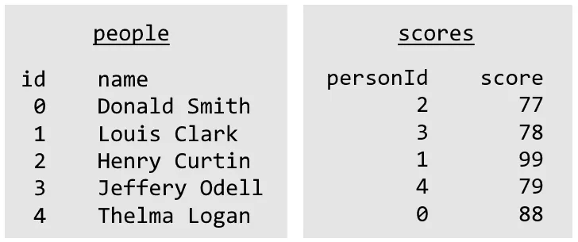
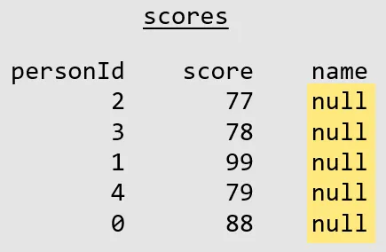
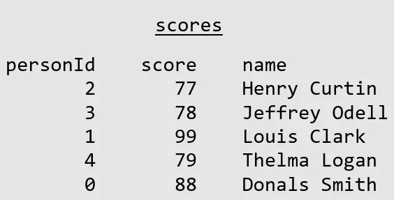

I'm always finding myself in the same position: I have a table with two or more columns. I need to fill in one of those columns based on another one. However, the data I need is in a separate table.


Here is an example of this scenario. Say we have two tables with two columns each.

*Two tables in our database*

Each record in the `people` table has an `id` and a `name`. Each record in the `scores` table has a `personId` which is linked `people.id` and a `score`.

If we wanted to retrieve data containing `name`s next to `score`s, we could do this easily with a `JOIN`:

```
SELECT    p.name,
          s.score
FROM      people p
JOIN      scores s
ON        p.id = s.personId
```


*The query result showing names and scores*

But what happens when our project calls for a change: names are now required to be stored in the `scores` table. After adding the new column, how do we insert the data?

*All names are null*

We need to update one table based on another. This can be solved using an `UPDATE` with a `JOIN`.

### MSSQL

```
UPDATE        scores
SET           scores.name = p.name
FROM          scores s
INNER JOIN    people p
ON            s.personId = p.id
```


### MySQL

```
UPDATE    scores s,
          people p
SET       scores.name = people.name
WHERE     s.personId = p.id
```


And our `scores` table is complete!

*Scores table with person names*

The commands above work for this specific scenario. For more generic versions of the same command, see below.

### Generic MSSQL

```
UPDATE        targetTable
SET           targetTable.targetColumn = s.sourceColumn
FROM          targetTable t
INNER JOIN    sourceTable s
ON            t.matchingColumn = s.matchingColumn
```


### Generic MySQL

```
UPDATE    targetTable t,
          sourceTable s
SET       targetTable.targetColumn = sourceTable.sourceColumn
WHERE     t.matchingColumn = s.matchingColumn
```
