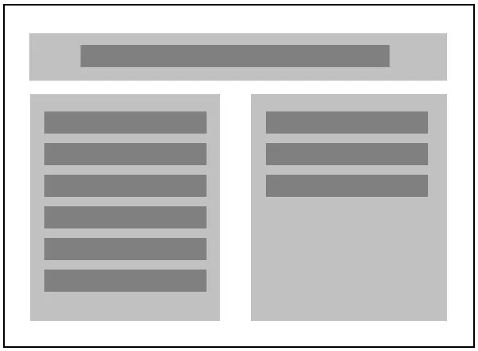
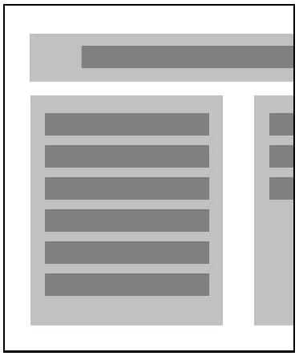
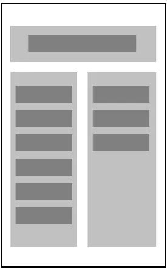
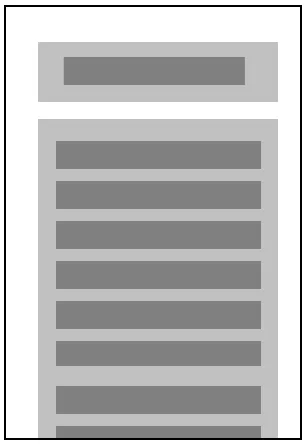

Responsive design means that your site is designed for all screen sizes. Imagine a site where all content is wrapped by a fixed width container:

```css
.container {
  width: 960px;
  margin: 0 auto;
}

.column {
  width: 50%;
  float: left;
}
```


Here's how it looks on a desktop:



Let's see what happens when it's viewed on a smaller screen:



The content is getting cut off!

We could just make the container fluid, maybe giving it a percentage width:

```css
.container {
  width: 75%;
  margin: 0 auto;
}
```


This makes sure the content is always in the frame:



But now everything is squished into really thin columns. Instead, what we want is for the content, which is broken into columns, to be organized in different ways for different screen sizes.

In order to do that, we can have CSS detect the screen size, and apply different styles. This is done with [Media Queries](https://developer.mozilla.org/en-US/docs/Web/Guide/CSS/Media_queries?redirectlocale=en-US&redirectslug=CSS%2FMedia_queries).

Adding a simple media query, with styles that will "un-float" our columns, makes it so that the page is in two columns on larger screens, but one column on smaller ones:

```css
@media all and (max-width: 960px) {
  .container {
    width: 100%;
  }

  .column {
    width: 100%;
    float: none;
  }
}
```


When the screen size is smaller than 960px (the default size of our container), the container and columns change styles so they fill the screen, like so:



The size 960px in the media query is called a breakpoint. You can add as many breakpoints with as many different styles as you need.

The method used above is called "desktop-first" design, which assumes the user will be using a large screen, and provides alternate styles for small screens. Many designers are now creating sites using a "mobile-first" principle, which assumes just the opposite: users will be using small screens, so design for those, and provide alternate styles for large screens. This trend is supported by the fact that more and more people are accessing the web on mobile devices.

If you like the mobile-first approach, just design your site for a small screen, and then use media queries like this:

```css
@media all and (min-width: 960px) {
  /* styles for large screens go here */
}
```

The styles you define here will be applied when the screen size is 960px or above.
