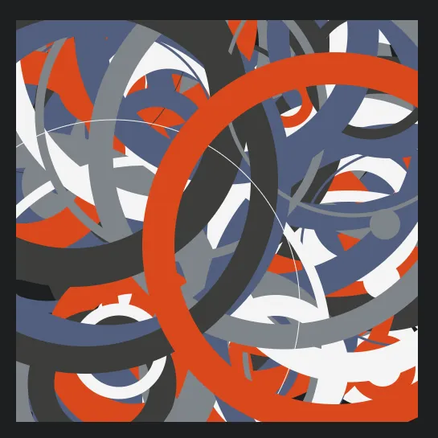

An "options object" is a programming pattern that you can use to pass any number
of named arguments to a function. Rather than using an ordered list of
arguments, you simply pass one argument, which is an object containing named
keys for all of your options. Keep reading to learn how and why.

Here, I have created an SVG "sketchpad."

```html
<div class="container">
  <svg id="sketch" class="sketch" viewBox="0 0 500 500"></svg>
</div>
```

I've given it some basic sizing and color styling.

```css
html {
  font-size: 22px;
}

body {
  background-color: #1d1f20;
}

.container {
  text-align: center;
  margin: 2rem;
}

.sketch {
  width: 500px;
  height: 500px;
}

.sketch circle {
  fill: none;
}
```

I want to add some shapes to this sketchpad. I _could_ do this directly in HTML.

```html
<div class="container">
  <svg id="sketch" class="sketch" viewBox="0 0 500 500">
    <circle cx="250" cy="250" r="228" />
  </svg>
</div>
```

But instead I'm going to create a JavaScript function that builds shapes and
appends them to the sketchpad.

```javascript
const addCircle = (svg) => {
  const c = document.createElementNS("http://www.w3.org/2000/svg", "circle");

  c.setAttribute("cx", 250);
  c.setAttribute("cy", 250);
  c.setAttribute("r", 228);
  c.setAttribute("stroke-width", 44);
  c.setAttribute("stroke", "#F06D06");

  svg.appendChild(c);
};
```

I can call this function on the sketchpad to add a circle.

```javascript
const sketch = document.getElementById("sketch");
addCircle(sketch);
```


Here's what I have so far.

Now I want to be able to programmatically set the color. I'll do this by adding
another argument to the function, and using that argument when setting the
stroke.

```javascript
const addCircle = (svg, color) => {
  const c = document.createElementNS("http://www.w3.org/2000/svg", "circle");

  c.setAttribute("cx", 250);
  c.setAttribute("cy", 250);
  c.setAttribute("r", 228);
  c.setAttribute("stroke-width", 44);
  c.setAttribute("stroke", color);

  svg.appendChild(c);
};
```

I can now call the function with any color I want.

```javascript
addCircle(sketch, "#525F7F");
```


What if I want to set _even more_ attributes for the circle? I _could_ keep
adding arguments all day.

```javascript
const addCircle = (svg, color, x, y, r, width) => {};
```

But having so many arguments can get confusing. Consider that, when calling this
function, I would have to remember in which order it expects the arguments.

Instead, I'm going to re-write the function to use the options object pattern.

```javascript
const addCircle = (options) => {
  const c = document.createElementNS(
    '[http://www.w3.org/2000/svg'](http://www.w3.org/2000/svg'),
    'circle'
  );

  c.setAttribute('cx', 250);
  c.setAttribute('cy', 250);
  c.setAttribute('r', 228);
  c.setAttribute('stroke-width', 44);
  c.setAttribute('stroke', options.color);

  options.svg.appendChild(c);
}
```

This changes how I must call the function.

```javascript
addCircle({
  svg: sketch,
  color: "#525F7F",
});
```

The function call is more verbose but also more clear.

Now I'll start adding more options.

```javascript
const addCircle = (options) => {
  const c = document.createElementNS("http://www.w3.org/2000/svg", "circle");

  c.setAttribute("cx", options.x);
  c.setAttribute("cy", options.y);
  c.setAttribute("r", options.r);
  c.setAttribute("stroke-width", options.width);
  c.setAttribute("stroke", options.color);

  options.svg.appendChild(c);
};
```

I can call the new function like this.

```javascript
addCircle({
  svg: sketch,
  color: "#525F7F",
  x: 250,
  y: 250,
  r: 228,
  width: 39,
});
```

Or I could also do this.

```javascript
addCircle({
  x: 250,
  y: 250,
  r: 228,
  width: 39,
  color: "#525F7F",
  svg: sketch,
});
```

Notice the _order_ of the arguments no longer matters. The function finds the
correct argument by _name_.

I could stop here, but it would be nice to have some default options so I don't
have to include a full options object each time I call the function.

```javascript
const addCircle = (options) => {
  const c = document.createElementNS(
    '[http://www.w3.org/2000/svg'](http://www.w3.org/2000/svg'),
    'circle'
  );

  c.setAttribute('cx', options.x || 250);
  c.setAttribute('cy', options.y || 250);
  c.setAttribute('r', options.r || 228);
  c.setAttribute('stroke-width', options.width || 39);
  c.setAttribute('stroke', options.color || '#D9491D');

  options.svg.appendChild(c);
}
```

Notice all the [logical OR
operators](https://developer.mozilla.org/en-US/docs/Web/JavaScript/Reference/Operators/Logical_OR)
( `||` ). If the `options.x` value is
[falsy](https://developer.mozilla.org/en-US/docs/Glossary/Falsy), the default of
`250` is used instead. Same for `options.y` and so on.

So I can call the function with as few arguments as I want. Any options I don't
specify will fall back on the chosen defaults.

```javascript
addCircle({
  color: "#F4F4F4",
  r: 50,
  svg: sketch,
});
```


Just for fun — and to test out my new function — I'm going to feed it some
random values.

For this, I'm going to add [Lodash](https://lodash.com/) to the project. I'm
going to use [its `random` function](https://lodash.com/docs/4.17.23#random) on
all the circle's attributes.

```javascript
addCircle({
  x: _.random(0, 500),
  y: _.random(0, 500),
  r: _.random(0, 250),
  width: _.random(0, 50),
  svg: sketch,
});
```

Each time I run the function, it gives me a circle at a random location, with a
random size and random width.

_A circle of random shape and color_

I can even randomize the color by adding a list of colors to choose from and
having Lodash pick a random one with [its `sample`
function](https://lodash.com/docs/4.17.23#sample).

```javascript
const colors = ["#7F8489", "#F4F4F4", "#D9491D", "#3D3D3B", "#525F7F"];

addCircle({
  x: _.random(0, 500),
  y: _.random(0, 500),
  r: _.random(0, 250),
  width: _.random(0, 50),
  color: _.sample(colors),
  svg: sketch,
});
```


For even more fun, I'll create a loop and add ten circles.

```javascript
let i;
const maxCircles = 10;

for (i = 0; i < maxCircles; i += 1) {
  addCircle({
    /* snip */
  });
}
```


Let's try changing `maxCircles` to get an even busier sketch. Here's what one
hundred circles looks like.

_One hundred random
circles_

To what other shapes might you apply this pattern? To what other _tasks or
functions_ might you apply this pattern? It can be used anywhere you create a
function that accepts arguments.
