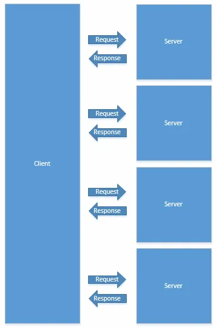

Traditionally, and with most modern web servers, it has been better to serve site assets from multiple domains, rather than from a single domain. But why is this the case?

The answer is speed. This speed comes from two main sources:

1. Parallelization

1. Reduced header overhead

### Parallelization

Serving assets from a single domain can be expressed in the following illustration.

*A single server receiving multiple requests and sending multiple responses*

If you send 50 requests and each one takes 5 milliseconds for the server to process and respond to, that’s 250 milliseconds.

However, if we serve assets from multiple domains, it can look like this:

*Multiple servers receiving and responding to requests*

If you send 50 requests to (a generally ridiculous) 50 servers and each one takes 5 milliseconds to respond, that’s only 5 milliseconds. In our extreme hypothetical scenario, we would save 245 milliseconds. In this case, the bottleneck would be the client’s ability to send and receive data.

### Reduced header overhead

Every HTTP request and response includes a header. The header is meta information about the request/response. To name a few:

* what data formats the client will accept

* how long to keep the connection alive

* from where was the client referred

If set, the header will also contain a [cookie](https://en.wikipedia.org/wiki/HTTP_cookie). The cookie is a piece of information that is attached to all requests to a particular domain. If your server’s domain set a cookie on the client, that client will send the cookie on *every *request it makes to your domain, including those requests for static assets.

The cookie is usually very small. But they can add up quick. If the cookie is 2 kilobytes, but there are 50 requests, that’s an extra 100 kilobytes for every page load. It can quickly get out of hand.

The solution is to make requests to a separate domain that has not set a cookie. Your dynamic content can be served from one domain with a cookie, but your static content should be served from a separate cookie-less domain. This will cut out the useless cookie information in the header and boost page speed.
